== Exercise 1 - Setup

=== What you will learn

Participants will learn how to:

1. install JBoss EAP 7 in a development environment.
2. add an administrative user.
3. configure a server adapter to an installed JBoss EAP 7 in JBoss Developer Studio.

=== Background information

JBoss Developer Studio is an Eclipse based IDE with plugins to help development. JBoss Developer Studio comes in three different alternatives:

1. *Bundle with JBoss EAP*
+
A single download and installation that JBoss EAP. This options is best if you are going to develop on the specific version of JBoss EAP that is in the bundle
2. *Standalone installation*
+
This is a standalone download that will only install and JBoss Developer Studio. Ev. application container like JBoss EAP has to installed and setup separately
+
NOTE: At the time of writing this the latest version of JBoss Developer Studio (e.g 9.1) with JBoss EAP is using JBoss EAP 6.4. We are therefor going to use the Standalone version in this exercise

3. *As a setup of plugins*
+
For users that already have Eclipse installed another option is to install JBoss Developer Studio plugins into an existing version. This option is great if your organization has a standardized IDE setup building on Eclipse.
+
NOTE: When using this options make sure that use the version of JBoss Developer Studio that is compatible with the version of Eclipse that you are using.

=== Setup the development environment

In this exercise we will setup and configure the development environment that we are going to use for the other ones.

Step 1 - Install JBoss EAP 7::
+
Unzip the downloaded JBoss EAP 7 zip distribution file in your home directory by opening a terminal window (there is a shortcut on your desktop) and executing the following commands:
+
[source,bash]
----
cd
unzip ~/software/jboss-eap-7.0.0.zip
----
+
NOTE: By executing cd with out any arguments one changes the current directory to the users home directory.

Step 1.1 - Add administrator to JBoss EAP 7:::

By default, the JBoss EAP installation is configured to be secure. There is no pre-configured administrative account for accessing the administrative console and managing the platform.
+
[source,bash]
----
cd ~/jboss-eap-7.0/bin
sh add-user.sh -u admin -p admin-123 -s
----
+
NOTE: This command will silently add an administrative user with username "admin" and password "admin-123". If you omit both arguments, `add-user.sh` will prompt for the information needed.

Step 1.2 - Set the JBOSS_HOME environment variable:::

Set your JBOSS_HOME environment variable by executing the following commands in a terminal:
+
[source,bash]
----
export JBOSS_HOME="~/jboss-eap-7.0"
echo "export JBOSS_HOME=${JBOSS_HOME}" >> ~/.bash_profile
----

'''

Step 2 - Verify the installation::
+
In order to verify the installation, we are going to start the server and login in the Administration console following the steps below.

Step 2.1 - Start the server:::
In the Terminal window run the following commands:
+
[source,bash]
----
cd ~/jboss-eap-7.0/bin
sh standalone.sh
----

Step 2.2 - Open firefox:::
Double-click on the _Firefox_ icon in the desktop.
+
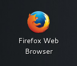
+

Step 2.3 - Open go to the welcome page:::
Type http://localhost:8080 in the address bar and click on the administration console Link.
+
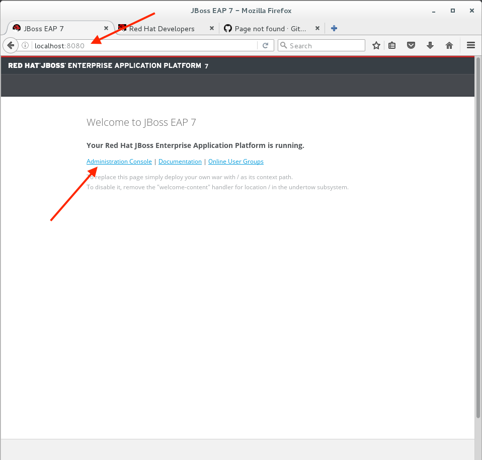
+

Step 2.4 - Login as administrator:::
Use the credentials from Step 1.1 to login to the administrative console.
+
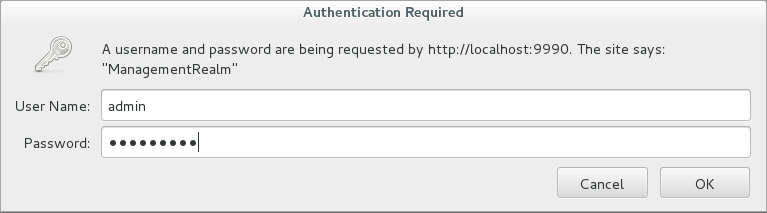
+

Step 2.5 - Verification:::
Verify that the administration console opens successfully.
+
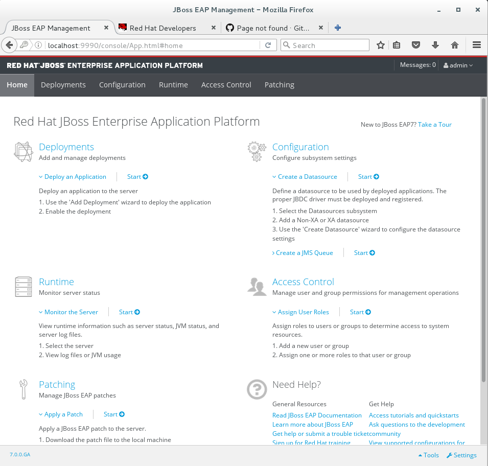
+
Also verify that there are no `ERROR` messages in the Terminal window.
+
image::images/01_13_terminal.png["Administration console",600]
+
NOTE: If you look carefully, you can see a `WARN` message saying `Node identifier property is set to the default value. Please make sure it is unique`. Node identifiers are used, when building clusters, but setting up a local development environment we can safely ignore this warning.

Step 2.6 - Shutdown JBoss EAP:::
After verifying that everything is working fine, we can stop JBoss EAP 7.
+
To stop JBoss EAP click on the Terminal window and press `CTRL-C`
+
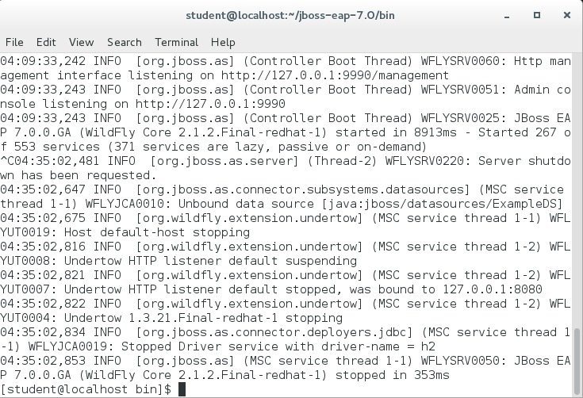

'''

Step 3 - Start JBoss Developer Studio::
Double-click on the _JBoss Developer Studio 9.1.0.GA_ icon in the desktop.
+
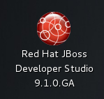
+
NOTE: The lab machine that you are using are already have `$HOME/workspace` configure as the workspace for JBoss Developer Studio. Otherwise you would now be prompted to select workspace location.

Step 3.1 - Click on link to add server:::
+
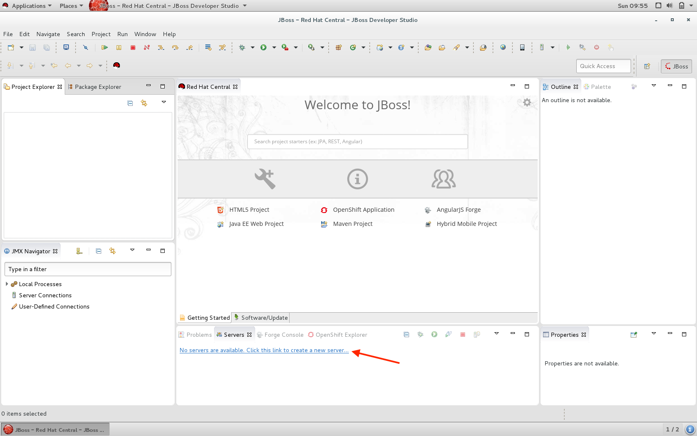

Step 3.2 - Select server type:::
Make sure that you select `Red Hat JBoss Enterprise Application Platform 7.0` and click `Next`.
+
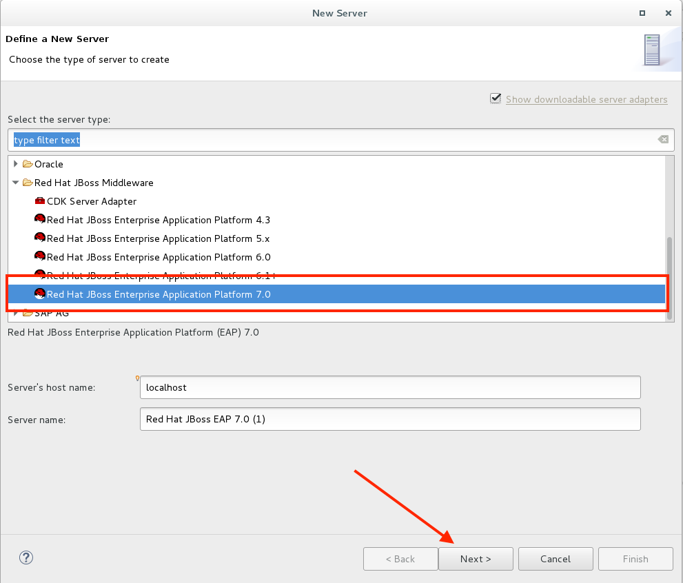
+
NOTE: If you have problems seeing the different server types make the window bigger by dragging in the bottom left corner.

Step 3.3 - Create a new Server adapter:::
Make sure that the default settings match the image below and click `Next`.
+
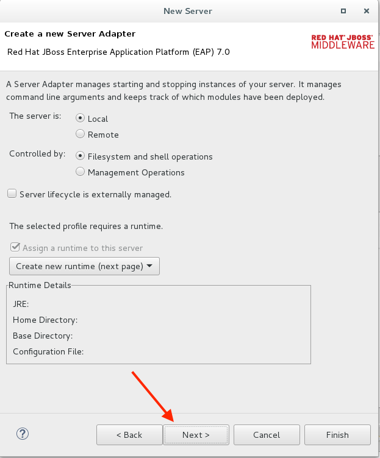

Step 3.4 - Select JBoss Runtime:::
Click on `Browse`.
+
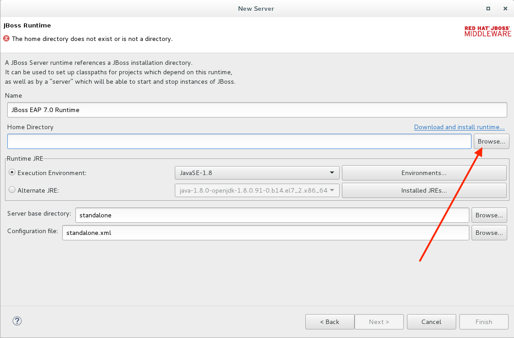

Step 3.5 - Point to JBoss EAP 7 installation directory:::
Click on `Home` in the left navigation and select `jboss-eap-7.0` directory to the right and click on `OK` in the top right corner.
+
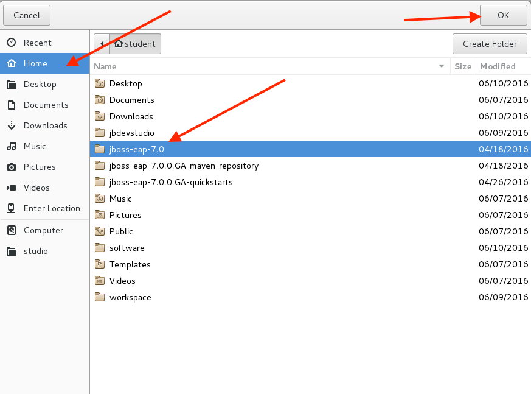

Step 3.6 - Finish the Add Server dialog:::
Click on `Finish`.
+
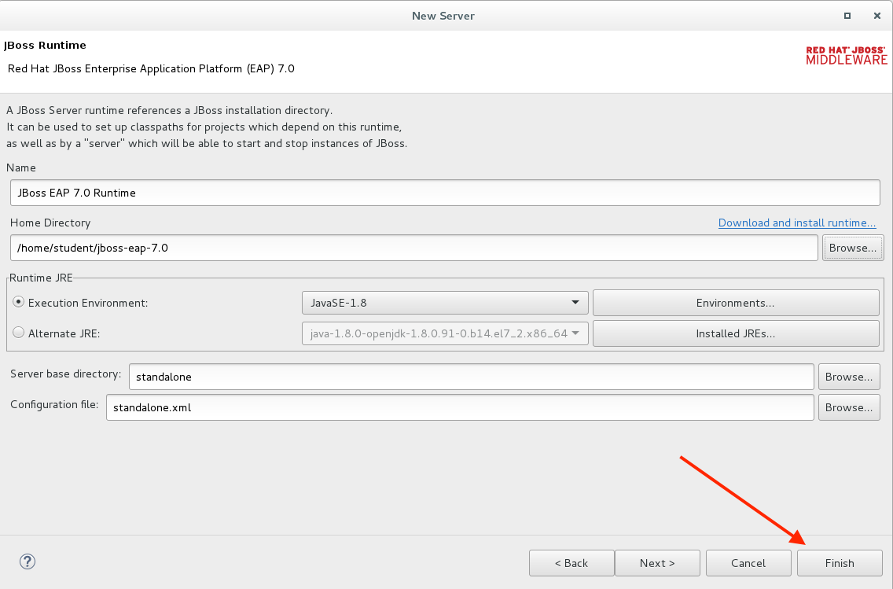

Step 3.6 - Verification:::
A server instance should now be available in the `Server` tab in JBoss Developer Studio.
+
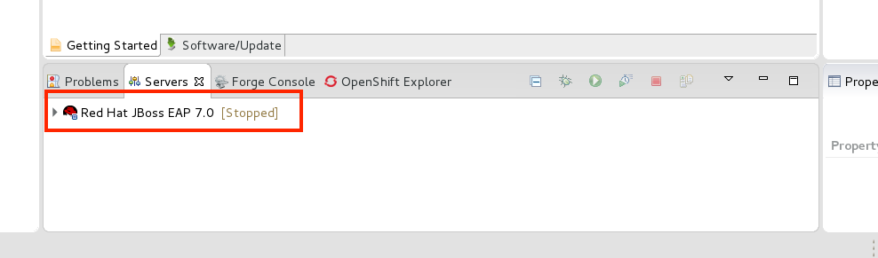

=== Summary

In this exercise you have learned how to setup a development environment using `JBoss Enterprise Application Platform 7` and `JBoss Developer Studio 9.1`.

=== Links

For more information, please have a look at the following articles and documents:

* https://access.redhat.com/documentation/en/red-hat-jboss-enterprise-application-platform/7.0/getting-started-guide/getting-started-guide[JBoss EAP 7 docs - Getting Started Guide]
* https://access.redhat.com/documentation/en-US/Red_Hat_JBoss_Developer_Studio/9.1/html/Install_Red_Hat_JBoss_Developer_Studio/index.html[JBDS 9.1 docs - Install JBoss Developer Studio]
