== Exercise 2 - Front-End

=== What you will learn

Participants will learn how to:

* deploy and test changes directly from JBoss Developer Studio to JBoss EAP 7.
* use the LiveReload feature for a very quick turn around.
* use Arquillian.
* run integration and functional test directly within the IDE.

=== Background information

In this exercise we are going to use a testing framework called Arquillian. What makes Arquillian so powerful is that it saves a lot of development time having to write mocks to test your code. Also it captures eventual issues between your code and the container much earlier. With Arquillian you can run your test in the application container and therefore do not have to mock things like datasources, REST services, JMS, EJB, CDI, etc.  In this exercise we are going to use Arquillian for CDI, REST and WebBrowser testing. It does however have additional advanced features that are beyond what we will cover here. Please visit the http://arquillian.org[Arquillian project page] for more information.

NOTE: Arquillian is a JBoss Community Project and most of the developers are Red Hat Employees. Even so Arquillian may be used to run tests on most Java Application containers.

'''

=== Lab
Step 1 - Getting started by importing an existing project::
+
Step 1.1 - Switch to use the package explorer:::
The package view in JBoss Developer Studio offers a more compressed view of java project where source and test code are easier to access. To use it click on the `Package` tab.
+
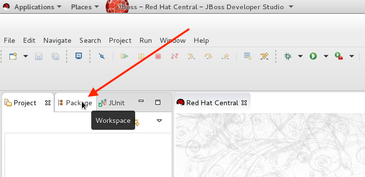

Step 1.2 - Import the project:::
We are now going to import a Maven project by `RIGHT CLICKING` in the Package view and select `Import`.
+
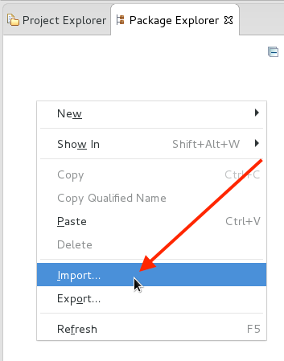
+
When the Import Dialog appears select `Maven -> Existing Maven Project` and click `Next`.
+
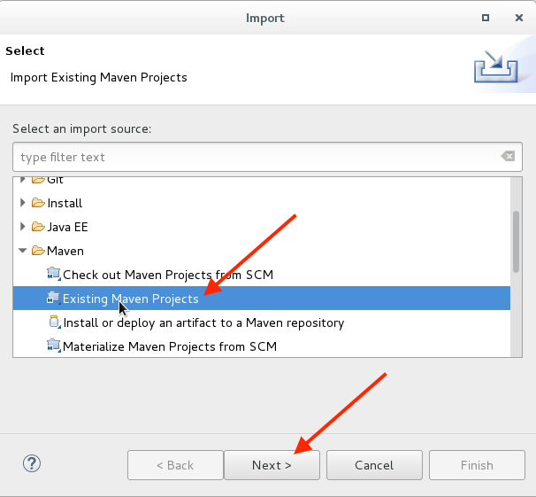
+
In the next dialog you need to select the root directory by clicking the `Browse...` button.
+
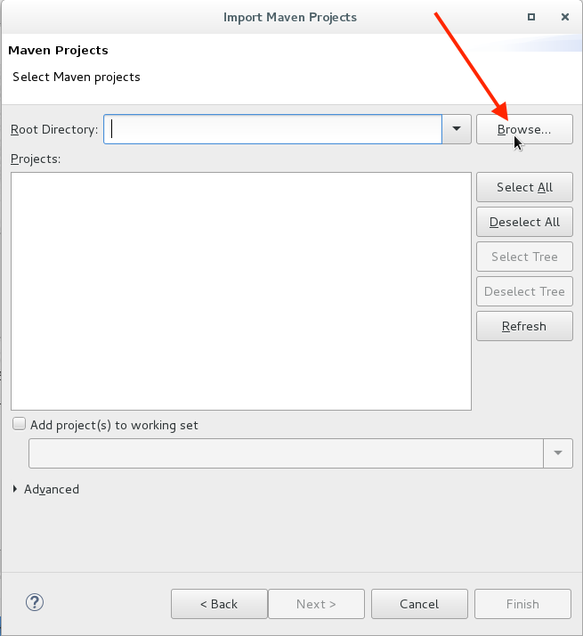
+
In the pop-up file dialog navigate to `$HOME/exercises/projects/02_frontend` by clicking on on `Home` shortcut to the left and then selecting exercises.
+
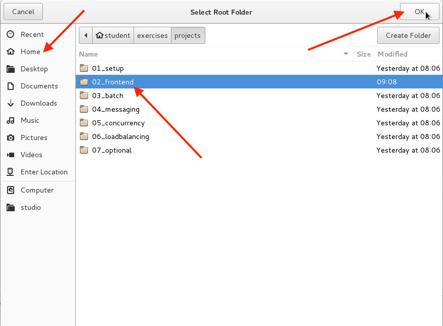
+
In the final step of the dialog verify that it automatically identified a single `pom.xml` and click `Finish`.
+
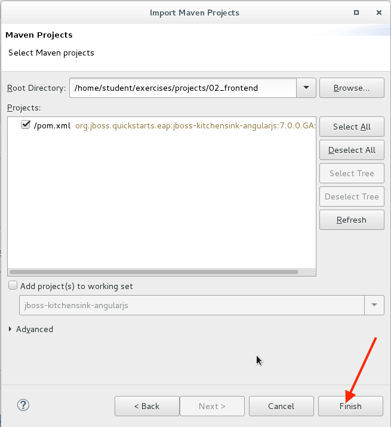
+
Let the IDE work for a while with importing the project and building the project. After sometime it will be done and your Package explorer should look something like the picture below.
+
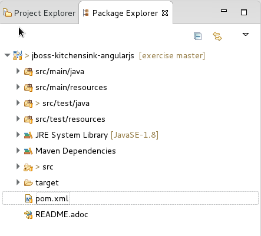

'''

Step 3 - Run the project on JBoss EAP 7::
After importing the project we are ready to deploy it to the local JBoss EAP 7 so that we can test it. This is done by `RIGHT CLICKING` the project it self and select "Run As > Run on Server"
+
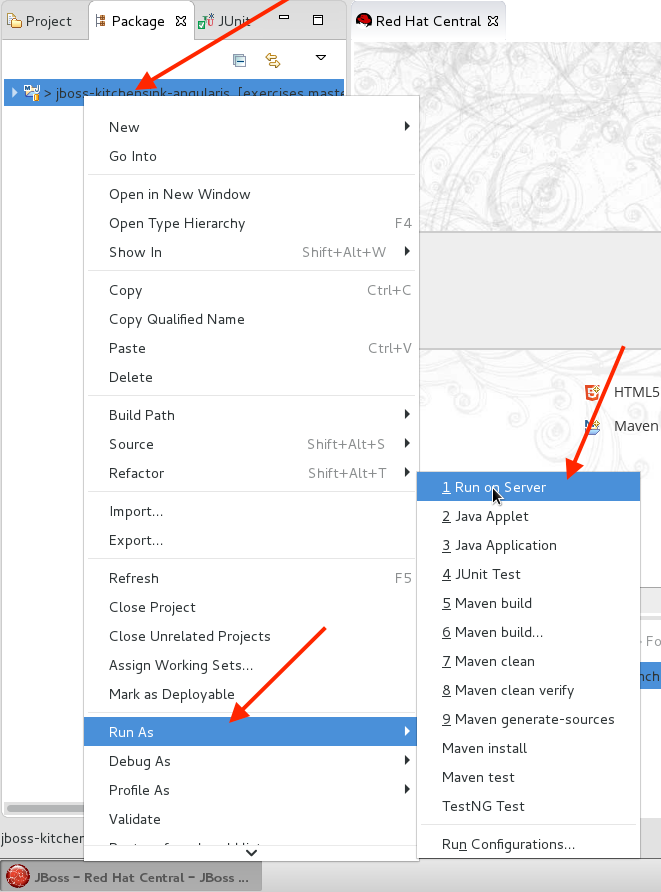
+
Select the `Red Hat JBoss EAP 7.0` Server instance that we configured in exercise 1 and click `Finish`
+
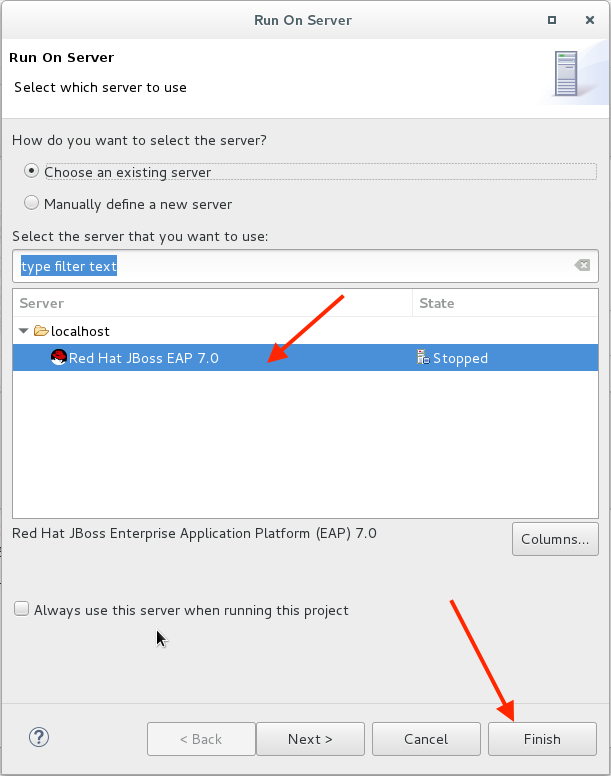
+
After JBoss EAP 7.0 has started and the application has been deploy to it a browser window should appear with the Welcome to Red Hat Summit page.
+
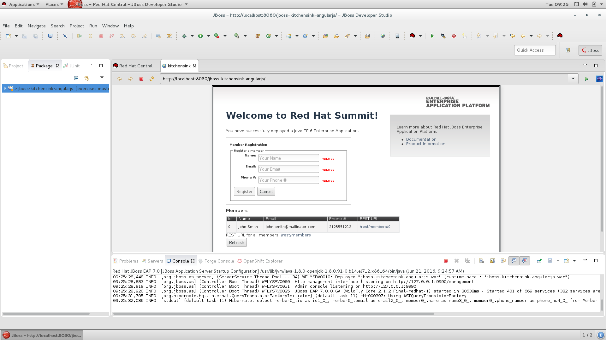
+
NOTE: Please check that there isn't any errors in the Console tab.

'''

Step 4 - Open the LiveReload browser::
There are multiple ways to deploy an application from the IDE. You can right click on the Application in the Server view and select `Incremental Publish` or `Full Publish`, you can also use the `touch` icon  that will execute an Incremental Publish. One can also execute a Maven build command with goal `wildfly:deploy` and it will deploy the application as part of Maven build triggered from the IDE.
+
Even if all the above alternatives only typically takes a couple of seconds to deploy, in a world of a developer where one are deploying hundreds of times per day even 10-20 seconds quickly adds up to allot of time.
+
Using the LiveReload feature of JBoss Developer Studio we can do most of the deployments needed in a working day much faster and changes are reflected immediately.
+
NOTE: Not all changes can be deployed using the LiveReload features, but periodically one will have to do Incremental or Full publish. However something like 9 out of 10 deployments are done with LiveReload it still saves a lot of time for the developers.
+
To enable LiveReload one all one have to do is to right click on the deployed application in the server view and select `Show In -> Web Browser via LiveReload Server`
+
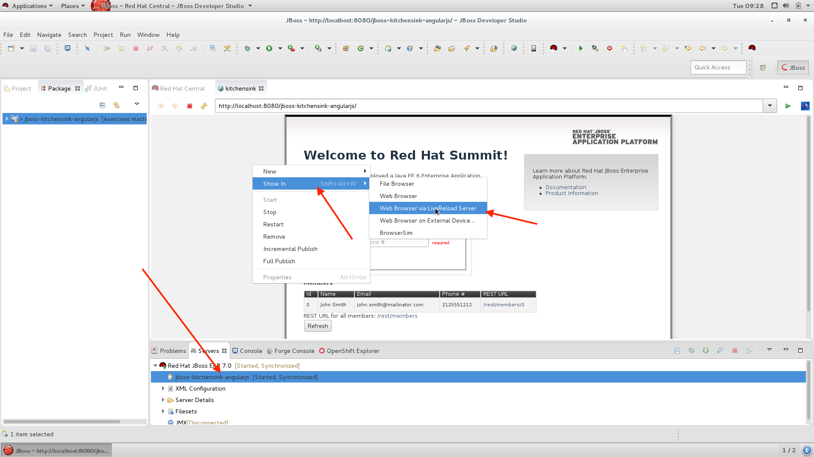
+
It will then prompt you for applying the configuration to the LiveReload Server. Click `Yes`.
+
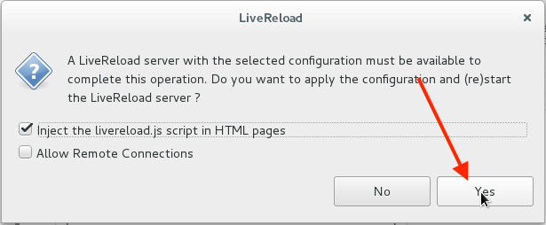
+
This will automatically configure, create and start a LiveReload Server for us that is going to listen to an available port above 56000.
+
After a while firefox (which is the default browser in your lab environment) will open a page using the LiveReload Server.
+
NOTE: The LiveReload server is not using the standard port 8080 but are randomly assigned to an available port above 56000.

Step 5 - Using LiveReload::
To see the LiveReload feature in action it's recommended that you place firefox and JBoss Developer Studio next to each other. In Gnome 3 (which is what you lab environment is using) you can grab a window by pressing down the mouse button on the title bar and drag the window to one of the sides. When you are at the edge of the window half the window should become gradient indicating that if you release the mouse here it will arrange the window to that half of the window.
+
To test the LiveReload feature type `CTRL` + `SHIFT` + `R` to open `Open Resource` dialog. Using this dialog one can open files and resources in the project in a convenient way. Since we are going to open a page called `home.html` start typing `home` in the search bar and then press `ENTER` when the home.html file is selected.
+
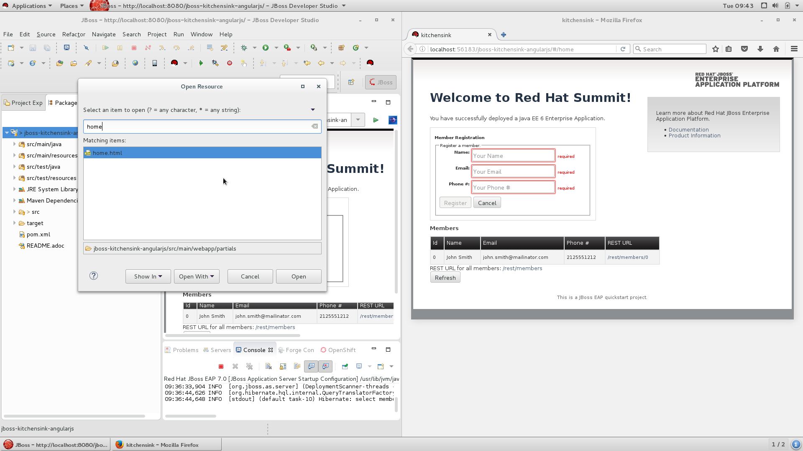
+
In `home.html` change line 20 which current reads:
+
[source,html,linenums]
----
include::projects/02_frontend/src/main/webapp/partials/home.html[lines=20..21]
----
+
to instead look like this:
+
[source,html,linenums]
----
    <h1>Welcome Student!</h1>
----
+
Save the file by pressing `CTRL` + `s` and your change should immediately be reflected in the firefox web browser.
+
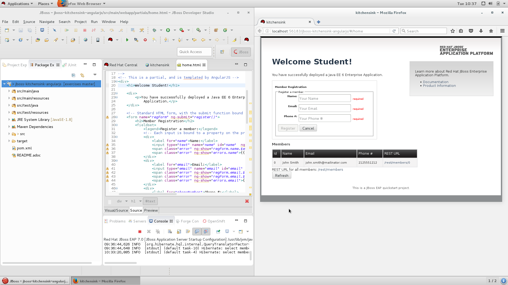

Step 6 - Implement a bug fix::
Now let's pretend that you are a developer for company X and you are tasked with verifying and solve an issue that customer to company X has reported.

Step 6.1 - Description of the issue:::
When registering to the site as a international user one cannot use the plus `+` in the phone field. Your task, should you accept it, is to fix this issue and implement tests to make sure that it doesn't happen again.
+
If you try to register a user using the + sign you cannot even press the register button.
+
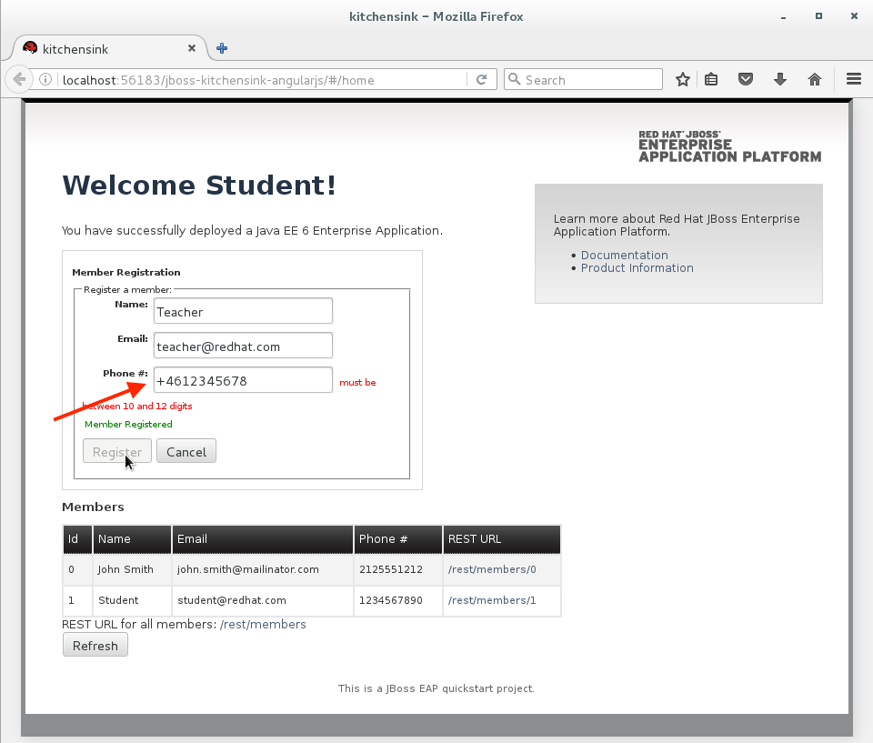
+
So we can confirm that this is an issue in the user interface (or client side). It may also be an issue in the backend or even in the communication between the client and the backend (REST). Let's see if our current test cases cover this issue, by right clicking on the `org.jboss.as.quickstarts.kitchensink.test` package under `src/test/java` and select `Run As` -> `JUnit Test`
+
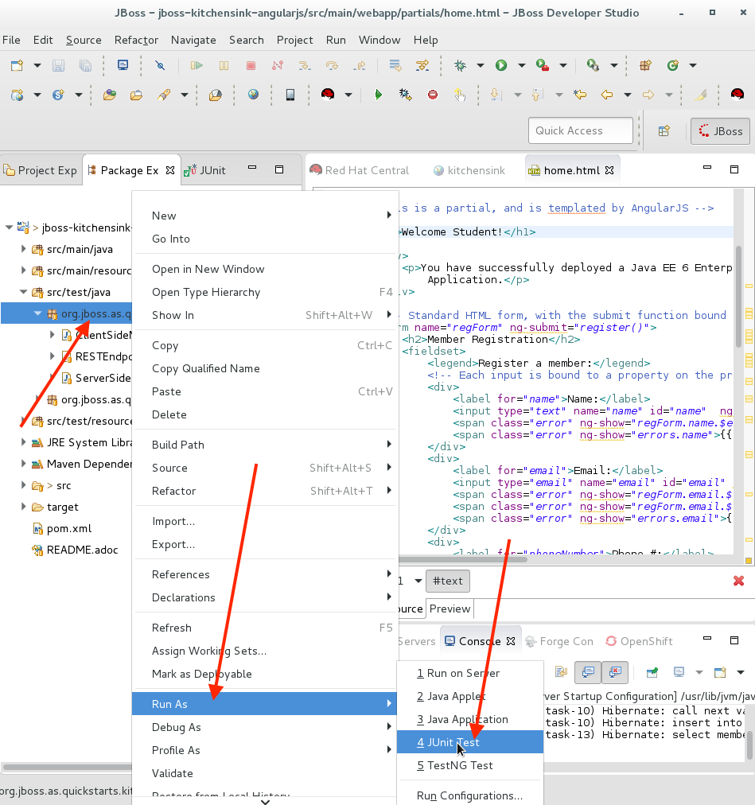
+
This will execute all the tests that we have in that package and it will take some time. However in comparison to having to manually having to test both the backend code, REST services and front-end code this time is very low.
+
What is happing right now is that each test actually deploys it's own version of the application and executes a couple of different tests.
+
The `ServerSideMemberRegistrationTest.java` test will only deploy the server side components and execute it's tests inside the container to verify that a Member can be registered.
+
.Code for deploying
[source,java]
----
include::projects/02_frontend/src/test/java/org/jboss/as/quickstarts/kitchensink/test/ServerSideMemberRegistrationTest.java[lines=39..46]
----
+
.CDI code that injects a CDI Bean
[source,java]
----
include::projects/02_frontend/src/test/java/org/jboss/as/quickstarts/kitchensink/test/ServerSideMemberRegistrationTest.java[lines=48..49]
----
+
.Example of a test case
[source,java]
----
include::projects/02_frontend/src/test/java/org/jboss/as/quickstarts/kitchensink/test/ServerSideMemberRegistrationTest.java[lines=54..63]
----
+
- The `RESTEndpointMemberRegistrationTest.java` will deploy the business object and the REST endpoints to the server and then run the tests on client side.
+
.Constructor annotation for running on Client side
[source,java]
----
include::projects/02_frontend/src/test/java/org/jboss/as/quickstarts/kitchensink/test/RESTEndpointMemberRegistrationTest.java[lines=52..54]
----
+
.Code for deploying
[source,java]
----
include::projects/02_frontend/src/test/java/org/jboss/as/quickstarts/kitchensink/test/RESTEndpointMemberRegistrationTest.java[lines=76..84]
----
+
.Inject URL on which the application is running
[source,java]
----
include::projects/02_frontend/src/test/java/org/jboss/as/quickstarts/kitchensink/test/RESTEndpointMemberRegistrationTest.java[lines=68..69]
----
+
.Example of a test case
[source,java]
----
include::projects/02_frontend/src/test/java/org/jboss/as/quickstarts/kitchensink/test/RESTEndpointMemberRegistrationTest.java[lines=86..98]
----
- The `ClientSideMemberRegistrationTest.java` will deploy all the backend, REST services and the frontend, however to make sure that it doesn't collide the existing deployment it will use it's own datasource and JPA persistence context.
+
.Constructor annotation for running on Client side
[source,java]
----
include::projects/02_frontend/src/test/java/org/jboss/as/quickstarts/kitchensink/test/ClientSideMemberRegistrationTest.java[lines=52..54]
----
+
.Inject elements for web browser testing and web driver
[source,java]
----
include::projects/02_frontend/src/test/java/org/jboss/as/quickstarts/kitchensink/test/ClientSideMemberRegistrationTest.java[lines=59..61;65..67;71..73]
----
+
.Code for deploying
[source,java]
----
include::projects/02_frontend/src/test/java/org/jboss/as/quickstarts/kitchensink/test/ClientSideMemberRegistrationTest.java[lines=85..94]
----
+
.Example of a test case
[source,java]
----
include::projects/02_frontend/src/test/java/org/jboss/as/quickstarts/kitchensink/test/ClientSideMemberRegistrationTest.java[lines=183..188]
----
+
So far the tests are executing fine and returning a green bar.
+
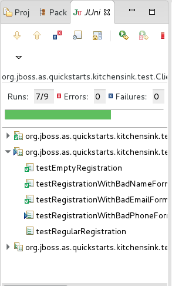
+
If all your tests execute fine then we have an issue that our current tests doesn't cover the international phone number.

Step 6.1 - Improve the tests:::
+
To improve the test we should add a test that uses international numbers, however in interest of time for this exercise we are instead going to change the existing test to use an international number. This is done by the following 3 changes:
+
1. Change row 59 of `ServerSideMemberRegistrationTest.java`
+
[source,java]
----
include::projects/02_frontend/src/test/java/org/jboss/as/quickstarts/kitchensink/test/ServerSideMemberRegistrationTest.java[lines=59..59]
----
+
to
+
[source,java]
----
        newMember.setPhoneNumber("+2125551234");
----
+
2. Change row 58 of `RESTEndpointMemberRegistrationTest.java`
+
[source,java]
----
include::projects/02_frontend/src/test/java/org/jboss/as/quickstarts/kitchensink/test/RESTEndpointMemberRegistrationTest.java[lines=58..58]
----
+
to
+
[source,java]
----
    private static final String NEW_MEMBER_PHONE = "+1234567890";
----
+
3. Change row 124 of `ClientSideMemberRegistrationTest.java`
+
[source,java]
----
include::projects/02_frontend/src/test/java/org/jboss/as/quickstarts/kitchensink/test/ClientSideMemberRegistrationTest.java[lines=124..124]
----
+
to
+
[source,java]
----
    private static final String PHONE_FORMAT_OK = "+0123456789";
----
+
Make sure that you've saved all the files and execute the test again by clicking the icon for Rerun Test.
+
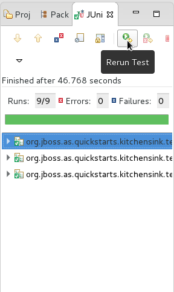
+
Now the tests should fail. This is good. We now have a tests that can verify if using international numbers works or not. From the tests we can also verify that it's only the client side or frontend that has issues with the `+` sign.
+
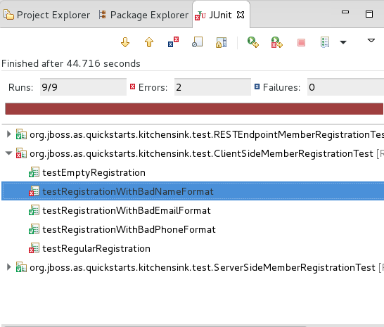

Step 6.2 - Fixing the issue:::
+
Open `home.html` again, it should already be open, but if you can't find the tab please refer to Step 4 on how to use the `Open Resource` dialog.
+
Change row 48 of `home.html`
+
[source,html]
----
  ng-pattern="/^[0-9]{10,12}$/"
----
+
to
+
[source,java]
----
  ng-pattern="/^\+?[0-9]{10,12}$/"
----
+
NOTE: If you are unfamiliar with regular expressions the first pattern says that number 0 to 9 are allowed between 10 and 12 times. The `^` character is used to indicate the start of string/row and `$` indicates the end. By adding `+?` we make it optionally for phone numbers to start with a `+` sign. Also since `+` is a special characters in regular expressions we need to escape it using a back slash `\` before.
+
Now Rerun the tests again and make sure that everything is green.
+
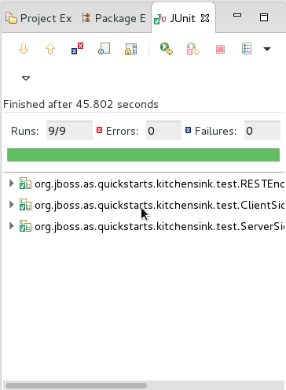
+
You can also verify by trying to add a user with an international phone number in the firefox browser.
'''

=== Summary

In this exercise you've learned how to use LiveReload feature of JBoss Developer Studio. You have also learned how to use Arquillian to execute both integration and functional tests. Finally you have successfully used these techniques to solve a bug in our test application.

=== Links

For more information, please have a look at the following articles and documents:

* http://arquillian.org/[Arquillian]
* https://access.redhat.com/documentation/en/red-hat-jboss-developer-studio/[Red Hat JBoss Developer Studio Documentation]
