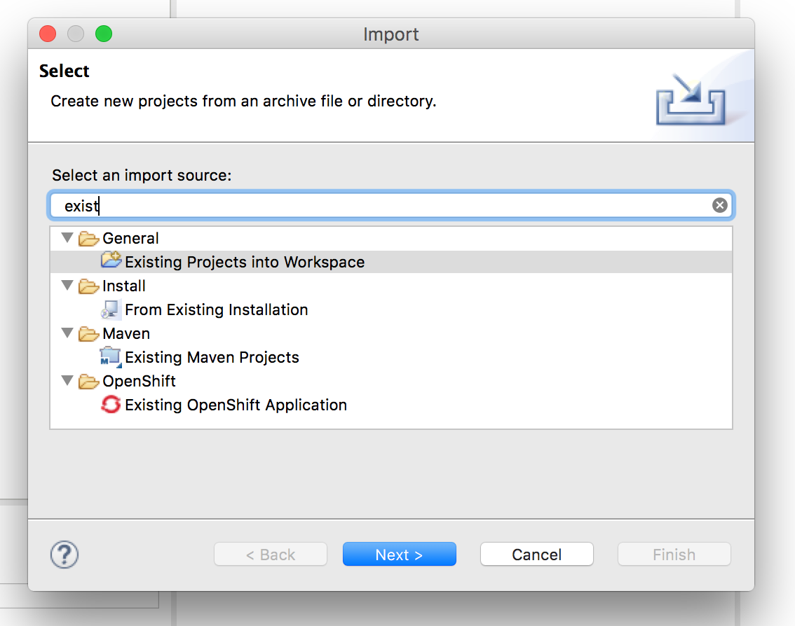
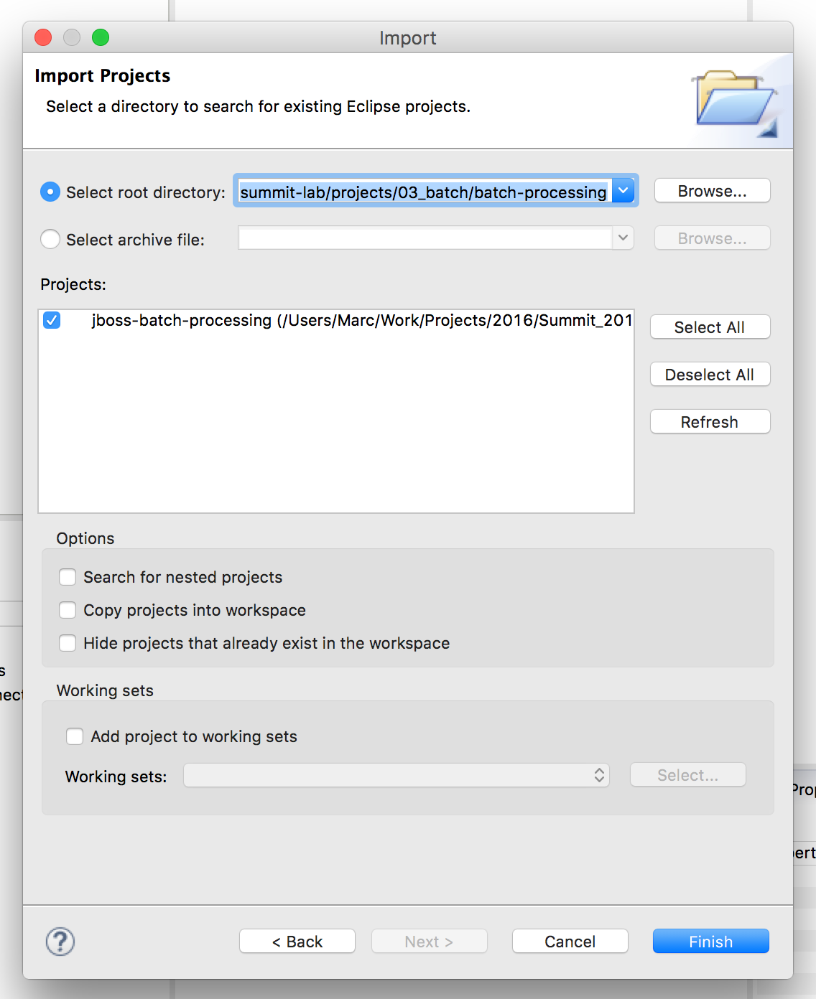
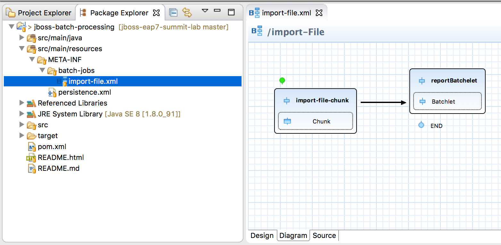
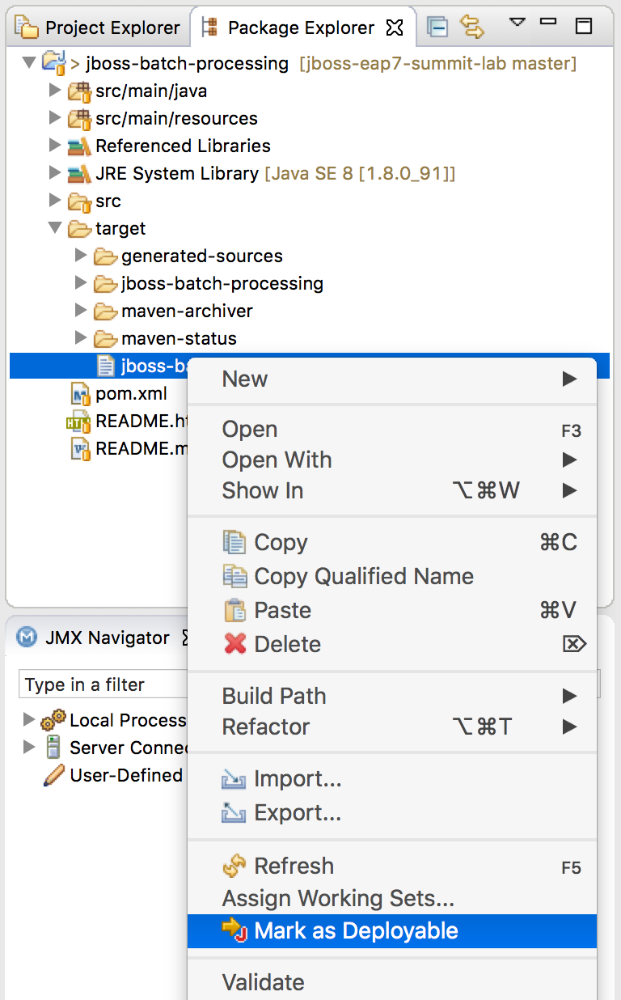
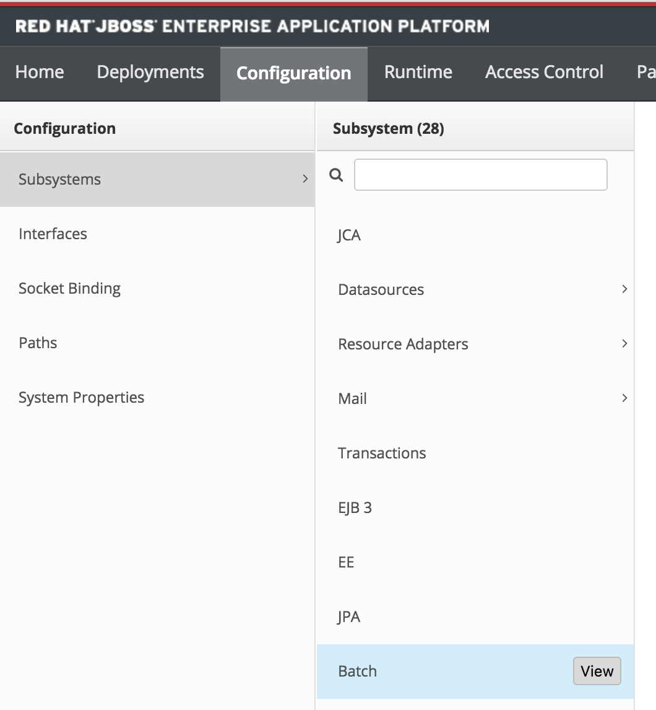
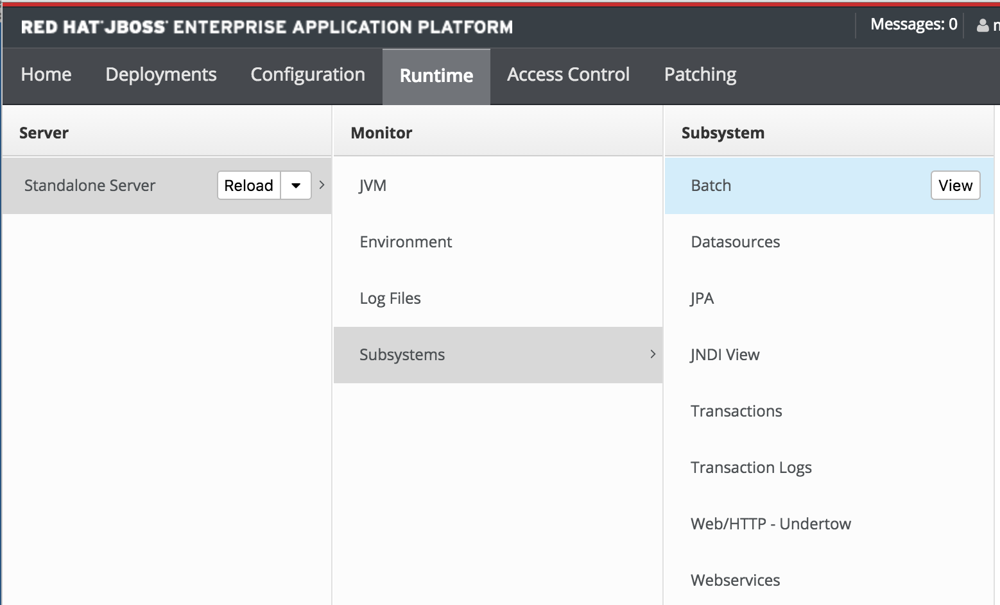
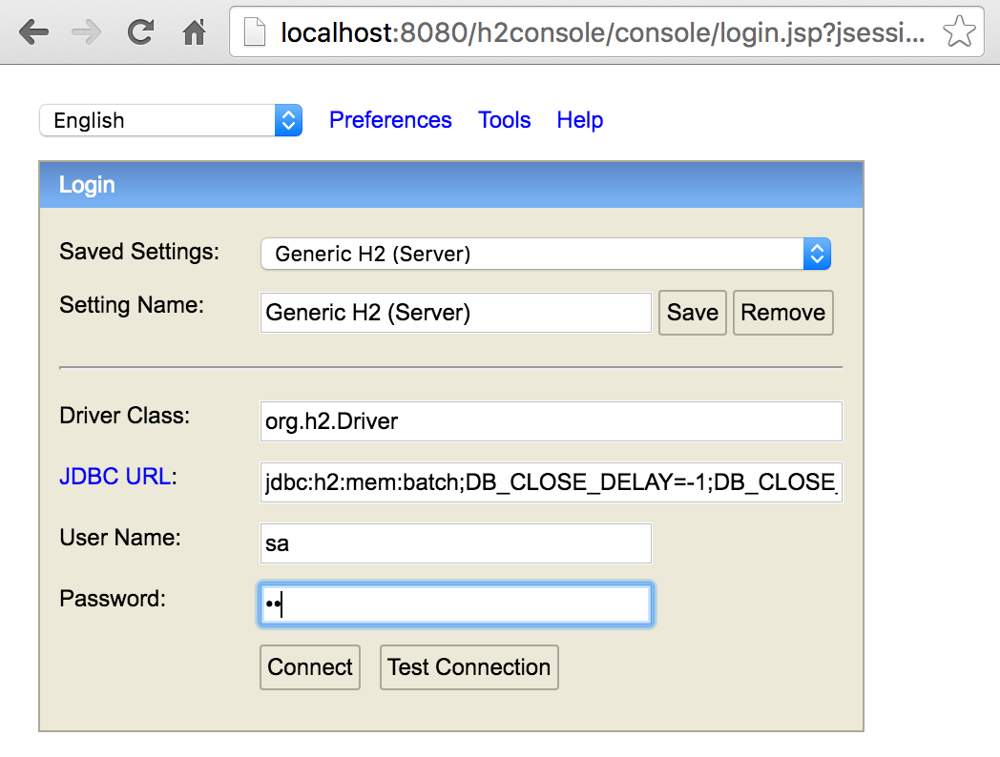

== Exercise 3 - Batch Applications

=== What you will learn

Doing this exercise, participants will learn:

* what is the Java Batch API and how it works.
* how to monitor Batches in Red Hat JBoss EAP 7.
* how to configure the "batch-jberet" subsystem.

=== Background information

==== What is it?

Java EE 7 includes the "Batch Applications for the Java Platform" (JSR-352) specification which can be used to define, implement and running batch jobs.

Batch jobs are composed of a set of tasks which can be automatically executed without user interaction. These jobs can be executed periodically or when resource usage is low. They often process large amounts of information and are quite resource demanding.

The Java EE batch framework includes a Java API an XML configuration and a batch runtime. The implementation of Java Batch API (JSR 352) is provided by a project named *JBeret* which allows also executing Batch activities as part of Java standard edition applications.

==== Vocabulary

Batch applications are broken down in a set of steps which specify their execution order. A simple batch might include just to elaborate sequentially a set of records, however more advanced ones may specify additional elements like decision elements or parallel execution of steps.

* *Steps* are independent and sequential phases of a batch job. A step it self can contain *chunk*-oriented steps and *task*-oriented steps.

* *Chunk* steps process data by reading items from a source, applying some transformation/business logic to each item, and storing the results. Chunk steps operate on one item at a time and group the results into a chunk. The results are stored when the chunk reaches a configurable size. Chunk-oriented processing makes storing results more efficient and facilitates transaction demarcation.
+
Each chunk is broken in three parts:
+
** *read* chunk part: used to read the single items from a source of data (database/fs/ldap etc.)
** *processor* chunk part: manipulates one item at a time using the logic defined by the application. (e.g. sorting, filtering data, transforming data etc.)
** *writer* chunk part: used to write the item which has been processed in the earlier phase.

* *Task* steps execute actions other than processing single items from a source. A typical example of task-oriented step might be some DDL on a database or operation on a file system. In terms of comparison a chunk oriented step can be used for massive, long running tasks whilst a task oriented step might be fit for a set of batch operations that are to be executed periodically.

* *Batchlet* are fully customizable batch steps that can be used for any type of background processing that does not explicitly call for a chunk oriented approach.

=== Lab

This lab builds on the "batch-processing" quickstart of JBoss EAP 7. It simulates a file importation using batch jobs.

Step 1 - Build the "batch-processing" quickstart project::
+
First build the batch-processing project as follows:
+
[source,bash]
----
$ cd ~/exercises/projects/03_batch/batch-processing # <1>
$ mvn clean eclipse:clean eclipse:eclipse install # <2>
$ pwd <3>
----
<1> Move to the directory of the quickstart.
<2> Clean and build the quickstart and generate the eclipse project
<3> Displays the current path (useful for import in JBDS)

Step 2 - Import the project in JBoss Developer Studio (JBDS)::
+
Open JBoss Developer Studio (desktop shortcut).
+
Import the maven project you just built. (File -> Import -> Existing Projects into Workspace -> Next -> Paste the project path from (3) ) -> Finish)
+

+

Step 3 - Have a look at the defined Job::
+
Open the xml file defining the job and have a look at its "Design", "Diagram" and "Source"
+
[source,bash]
----
/jboss-batch-processing/src/main/resources/META-INF/batch-jobs/import-file.xml
----
+

+
The job contains two steps ...
+
1. "import-file-chunk" (chunk oriented). The RecordsReader is responsible for parsing the file and create an instance of Contact. The ContactsFormatter applies the proper case to the Contact name and it also applies a mask to the phone number. Finally, ContactsPersister will send the Contact instance to the Database.
2. Log the number of records imported
+
... and a job-listener that modifies the job state if it was restarted.
+
Have a look at the classes implementing the Chunks, Batchlet and JobListener.
+
You will find more information about the quickstart in the "README.md" or "README.html" files.

Step 4 - Start JBoss EAP 7 and deploy the application::
+
Start your JBoss EAP 7 server as described in the first lab.
+
You have two options for deploying the "jboss-batch-processing.war" binary:
+
* Option 1: maven
+
Type this command to build and deploy the application:
+
[source,bash]
----
$ mvn clean install wildfly:deploy
----
* Option 2: JBDS
+
Right click on "/jboss-batch-processing/target/jboss-batch-processing.war" and select "Mark as Deployable"
+

Step 5 - Access the application::
+
Access the running application in a browser at the following URL: http://localhost:8080/jboss-batch-processing/
+
You’re presented with a simple form that allows you to generate sample files to be imported. As described in the README files, you will then be able to do the following operations:
+
* *Trigger a job importing a file*
+
Click on the "Generate a new file and start import job" button. Then investigate the console output.
+
* *Trigger a job with an error*
+
Check the "Generate a duplicate record" check-box and click again on the "Generate a new file and start import job" button. Analyze the logs the results.

Step 6 - Review the configuration of the JBoss EAP 7 subsystem::
+
Open the http://localhost:9990/console/[management console] of your running JBoss EAP 7 instance. Enter the previously defined management username and password.
+
Go to "Configuration -> Subsystems -> Batch" and click on "view" to display the current settings.
+

+
Those settings mirror exactly the configuration of the the standalone.xml:
+
[source,xml]
----
<subsystem xmlns="urn:jboss:domain:batch-jberet:1.0">
    <default-job-repository name="in-memory"/>
    <default-thread-pool name="batch"/>
    <job-repository name="in-memory">
        <in-memory/>
    </job-repository>
    <thread-pool name="batch">
        <max-threads count="10"/>
        <keepalive-time time="30" unit="seconds"/>
    </thread-pool>
</subsystem>
----
+
You will find more information on its configuration in "$JBOSS_HOME/docs/schema/wildfly-batch-jberet_1_0.xsd"
+
The runtime metrics related to the batch subsystem can also be viewed in the the http://localhost:9990/console/[management console] under Runtime -> Standalone Server -> Subsystems -> Batch -> View.
+

Step 7 - Update to a JDBC job-repository::
+
The current used job repository is purely in memory. Let's update it to a JDBC one.
+
First add the following line at the end of the the $JBOSS_HOME/bin/standalone.conf file and restart JBoss EAP 7:
+
[source,bash]
----
JAVA_OPTS="$JAVA_OPTS -Dcom.arjuna.ats.arjuna.allowMultipleLastResources=true"
----
+
Then execute update the JBoss EAP 7 configuration using CLI commands as follows:
+
[source,bash]
----
$ cd $JBOSS_HOME/bin
# Connect to Red Hat JBoss EAP 7 using the Command Line Interface (CLI)
$ ./jboss-cli.sh --connect
# Creates a new data-source "BatchDS"
[standalone@localhost:9990 /] /subsystem=datasources/data-source=BatchDS/:add(jndi-name="java:jboss/datasources/BatchDS",driver-name="h2",connection-url="jdbc:h2:mem:batch;DB_CLOSE_DELAY=-1;DB_CLOSE_ON_EXIT=FALSE",password="sa",user-name="sa",use-java-context=true)
# Register a new JDBC job-repository
[standalone@localhost:9990 /] /subsystem=batch-jberet/jdbc-job-repository=BatchDS/:add(data-source=BatchDS)
# Set the created job-repository as the default one
[standalone@localhost:9990 /] /subsystem=batch-jberet/:write-attribute(name=default-job-repository,value=BatchDS)
# Reload the full configuration
[standalone@localhost:9990 /] :reload()
----
+
Then have a look at the JBoss EAP 7 http://localhost:9990/console/[management console] as described in the previous step to see the changes done.

Step 8 - View the content of the job-repository::
+
Execute again a couple of batches on the deployed application (http://localhost:8080/jboss-batch-processing/), as described in step 5.
+
Deploy the "h2console.war" application available in "~/exercises/projects/03_batch/h2-console" to your running JBoss EAP 7.
+
Access the deployed h2console: http://localhost:8080/h2console
+

+
Enter the connection parameter for the created Batch data-source:
+
[cols="1,3", options="header"]
|===
2+| BatchDS datasource
| connection-url | jdbc:h2:mem:batch;DB_CLOSE_DELAY=-1;DB_CLOSE_ON_EXIT=FALSE
| user | sa
| password | sa
|===
+

Then, explore the content of the database (tables JOB_EXECUTION, JOB_INSTANCE, PARTITION_EXECUTION and STEP_EXECUTION). Re-execute the deployed batch application as described in step 4 and see its impact on the content of the job database.

Step 9 - Display all job details over the CLI::
+
To see even more details about the executed jobs, you can execute the following command over the CLI:
+
[source,bash]
----
[standalone@localhost:9990 /] /deployment=jboss-batch-processing.war/subsystem=batch-jberet:read-resource(recursive=true,include-runtime=true)
----
+

=== Summary

In this lab, you learned what is the Java Batch API and how it is implemented in Red Hat JBoss EAP 7 (Batch-JBeret subsystem). Then you built, deployed, executed and monitored a batch job and configured a JDBC batch job repository.

=== Links

To learn more about the Java Batch API and JSR-352 specification, please have a look at the following documents:

* http://www.mastertheboss.com/javaee/batch-api/running-batch-jobs-in-j2se-applications[Running Batch jobs in J2SE applications]

* http://www.slideshare.net/radcortez/con2818-java-ee-7-batch-processing-in-the-real-world[Java EE 7 Batch processing in the real world]

* https://docs.jboss.org/author/display/WFLY10/Batch+(JSR-352)+Subsystem+Configuration[EAP 7 - Batch Subsystem Documentation]

* https://www.gitbook.com/book/jberet/jberet-user-guide/details[JBeret User Guide]

* https://github.com/jberet[JBeret implementation]

* http://www.oracle.com/technetwork/articles/java/batch-1965499.html[Overview of Batch Processing in Java EE 7.0]

* http://blog.arungupta.me/schedule-javaee7-batch-jobs-techtip36/[Schedule Java EE 7 Batch Jobs]

* https://jaxenter.com/java-ee-7-introduction-to-batch-jsr-352-106192.html[Java EE 7 – Introduction to Batch]

* http://www.radcortez.com/java-ee-7-batch-processing-and-world-of-warcraft-part-1[Java EE 7 Batch processing example (WoW)]
