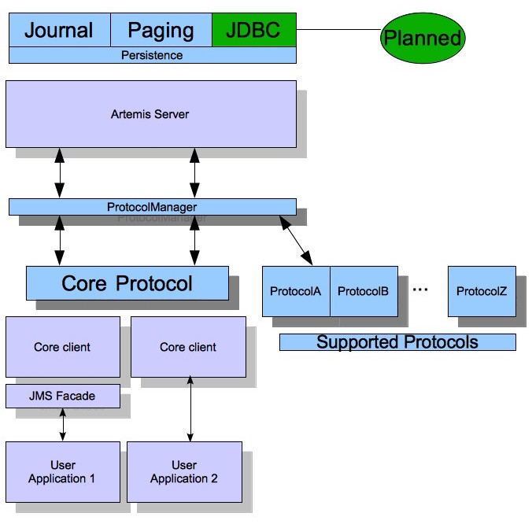
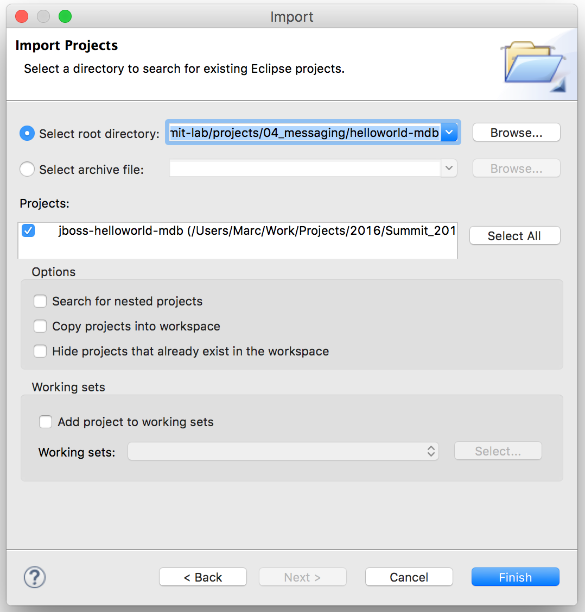
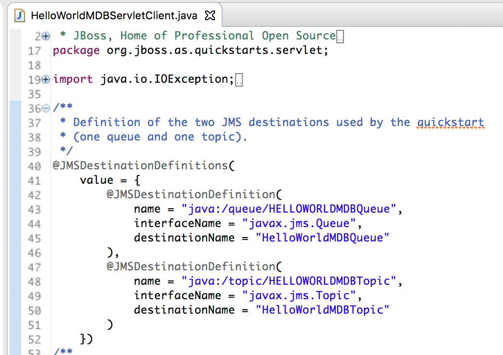
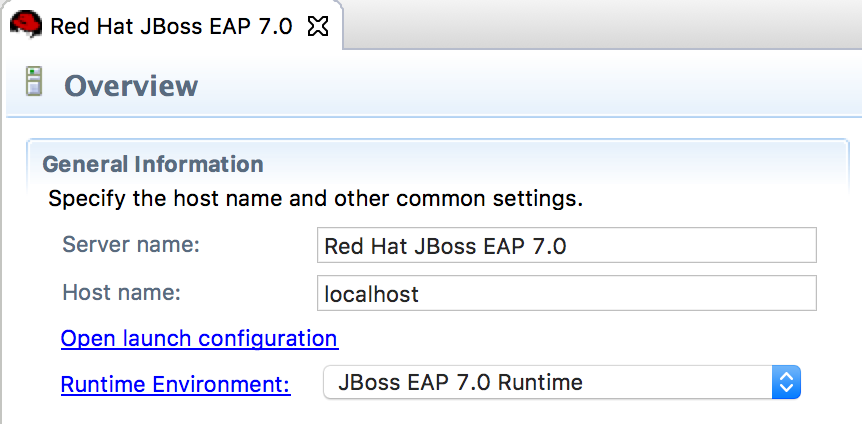
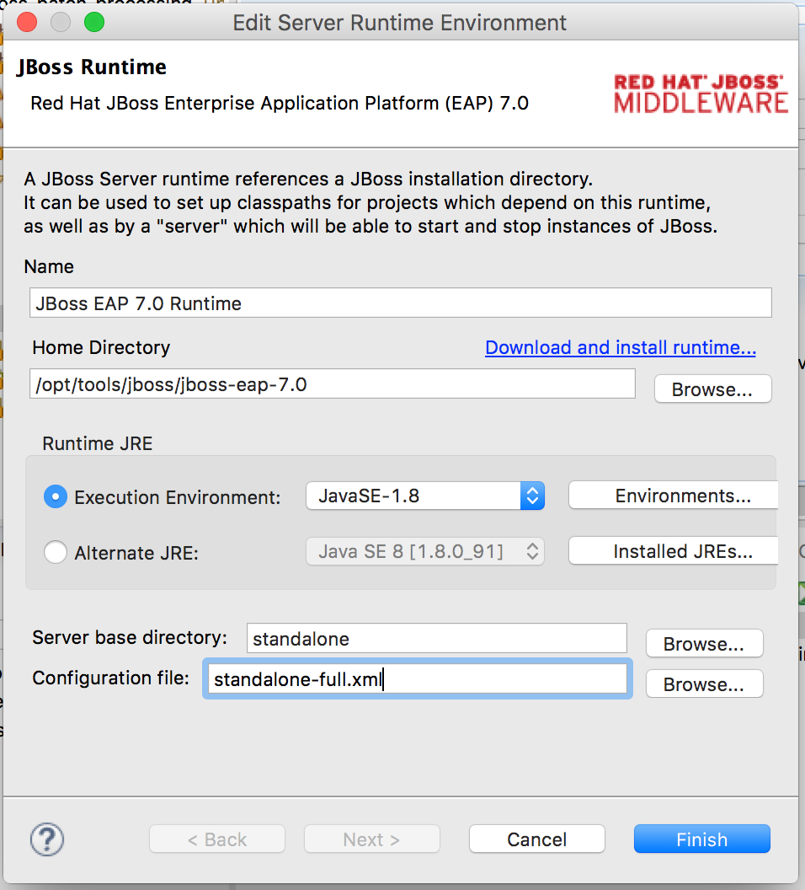
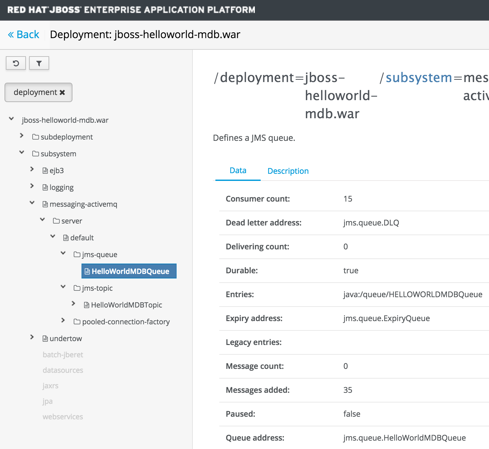
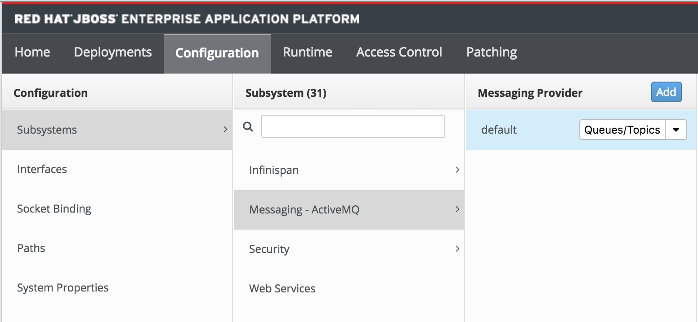
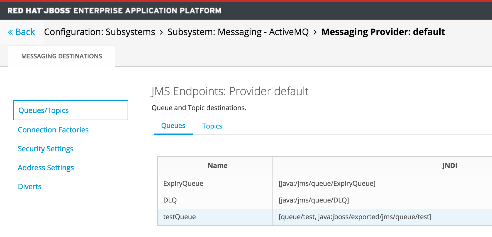
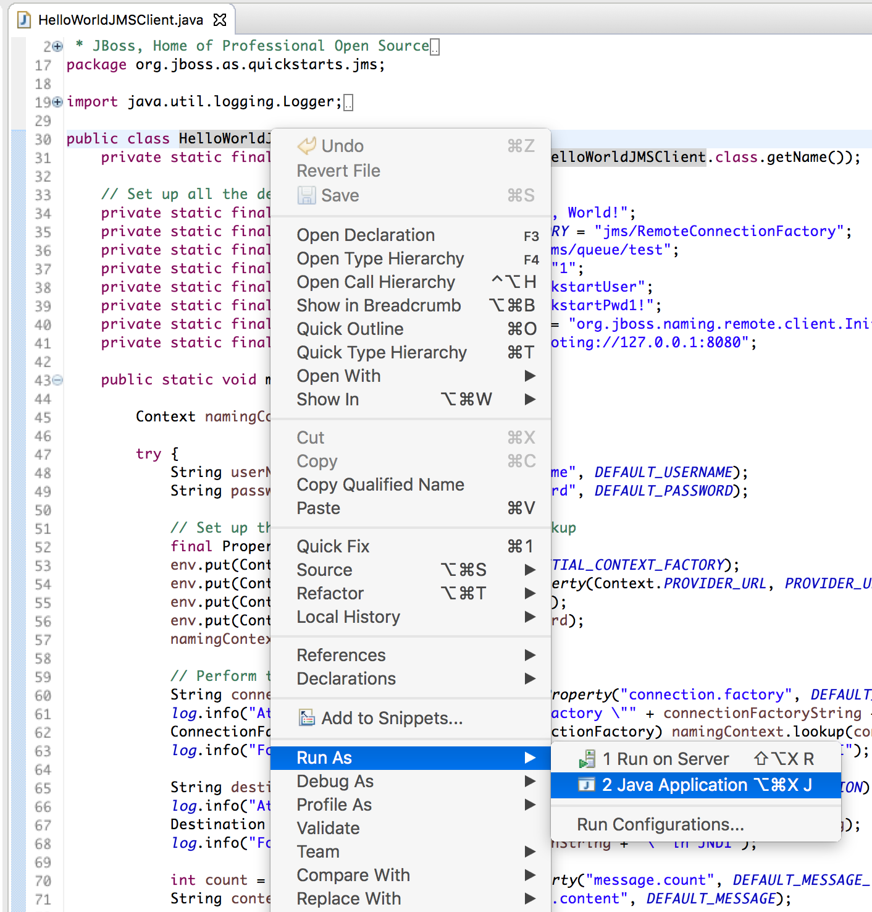

== Exercise 4 - Messaging with ActiveMQ Artemis

=== What you will learn

Doing this exercise, participants will learn:

* what are JMS 2.0 and ActiveMQ Artemis
* how to build and deploy a JMS application
* how to configure an outbound queue on EAP 7

=== Background information

=== Java Message Service 2.0

JMS is a Java API that provides both *point-to-point* and *publish-subscriber* messaging styles. JMS also incorporates the use of *transactions*. JMS does not define a standard wire format so while vendors of JMS providers may all use the standard APIs, they may use different internal wire protocols to communicate between their clients and servers.

JMS 2.0 (https://jcp.org/ja/jsr/detail?id=342[JSR342]) has been released with the Java EE 7 specification. It increases the ease-of-use of JMS and brings various new features, while keeping backward compatibility.

Here are the main new features of JMS 2.0:

* Simplified API and resource configuration
* Asynchronous messages sending
* Delayed message delivery
* Shared topic subscription (multiple consumers)
* Further features (JMSXDeliveryCount, MDB configuration properties)

==== ActiveMQ Artemis

http://activemq.apache.org/artemis/[Apache ActiveMQ Artemis] is an open source project for asynchronous messaging. It is high performance, embeddable, clustered and supports multiple protocols. JBoss EAP 7 uses Apache ActiveMQ Artemis as its JMS broker and is configured using the messaging-activemq subsystem. This fully replaces the HornetQ broker but retains protocol compatibility with JBoss EAP 6. The codebase for Artemis comes from HornetQ (JMS broker of Red Hat JBoss EAP 6), which was donated to the Apache ActiveMQ project. While ActiveMQ Artemis retains protocol compatibility with the HornetQ broker in JBoss EAP 6, it also contains some smart new features.

Some key facts about Artemis:

* New sub-project (2015)
* Code donation from Red Hat based on HornetQ
* JMS 2.0 implementation
* Non-blocking architecture (Netty / NIO)
* High-performance NIO Journal
* Supports many messaging protocols (Core, AMQP, STOMP, MQTT, OpenWire, HornetQ)

Note: STOMP, MQTT, AMQP are currently not supported in EAP 7.0.

The following picture show the High-level architecture of ArtemisMQ:

=== Lab

This lab builds on the "helloword-mdb" and "helloword-jms" quickstarts of JBoss EAP 7.

* "helloword-mdb" demonstrates the use of JMS, queues, topics and in-vm connection factories.
* "helloword-jms" will be used to produce and send messages using an external client

Step 1 - Build and import the "helloworld-mdb" project in JBDS::
+
First build the helloworld-mdb project as follows:
+
[source,bash]
----
# Move to the directory of the quickstart
$ cd projects/04_messaging/helloworld-mdb
# Clean and build the quickstart and generate the eclipse project
$ mvn clean eclipse:clean eclipse:eclipse install
# Displays the current path (useful for import in JBDS)
$ pwd
----
+
Then open JBoss Developer Studio (desktop shortcut).
+
Import the maven project you just built. (File -> Import -> Existing Projects into Workspace -> Next -> Paste "root directory") -> Finish)
+
image::images/03_01_import.png["JBDS import (1/2)",600]
+

Step 2 - Review the application::
+
The imported project creates two JMS resources:
+
* A queue named `HELLOWORLDMDBQueue` bound in JNDI as `java:/queue/HELLOWORLDMDBQueue`
* A topic named `HELLOWORLDMDBTopic` bound in JNDI as `java:/topic/HELLOWORLDMDBTopic`
+
Have a look at their consumption by Message Driven Beans ("HelloWorldQueueMDB" and "HelloWorldTopicMDB" classes) and at their definition ("HelloWorldMDBServletClient" class).
+

+
On Red Hat JBoss EAP 6, the definition of such queues and topics was done typically in a "hornetq-jms.xml" as follows:
[source,xml]
----
<?xml version="1.0" encoding="UTF-8"?>
<messaging-deployment xmlns="urn:jboss:messaging-deployment:1.0">
    <hornetq-server>
        <jms-destinations>
            <jms-queue name="HELLOWORLDMDBQueue">
                <entry name="/queue/HELLOWORLDMDBQueue"/>
            </jms-queue>
            <jms-topic name="HELLOWORLDMDBTopic">
                <entry name="/topic/HELLOWORLDMDBTopic"/>
            </jms-topic>
        </jms-destinations>
    </hornetq-server>
</messaging-deployment>
----

Step 3 - Configure JBoss EAP 7 to use the standalone-full profile::
+
This application requires the "standalone-full.xml" profile. If you start the server manually, please mind passing the profile parameter:
+
[source,bash]
----
$ $JBOSS_HOME/bin/standalone.sh -c standalone-full.xml
----
+
If your JBoss EAP 7 is configured within eclipse. You need to change the name of the used profile directly in the JBoss EAP 7.0 runtime configuration as follows:
+
* double click on your Server in the "Server" eclipse view
* click on "Runtime Environment" within the overview of your server
+

+
* change the "Configuration file" from "standalone.xml" to "standalone-full.xml"
+

+
Then start your JBoss EAP 7 server as described in the first lab.

Step 4 - Deploy the application::
+
You have two options for deploying the "jboss-helloworld-mdb.war" binary:
+
* Option 1: maven
+
[source,bash]
----
# Open a command prompt and navigate to the root of the helloworld-mdb directory:
$ cd projects/04_messaging/helloworld-mdb
# Compile and deploy the application
$ mvn clean install wildfly:deploy
----
* Option 2: JBDS
+
Right click on "/helloworld-mdb/target/jboss-helloworld-mdb.war" and select "Mark as Deployable"

Step 5 - Access the application::
+
The application should then be available and running at the following URLs:
+
* Access http://localhost:8080/jboss-helloworld-mdb/ to send some messages to the queue.
* Access http://localhost:8080/jboss-helloworld-mdb/HelloWorldMDBServletClient?topic to send some messages to the topic.
+
Then you should investigate the server console output to see that the JMS messages have been well sent and received.

Step 5 - View the runtime information to the created queues::
+
Open the http://localhost:9990/console/[management console] of your running JBoss EAP 7 instance. Enter the previously defined management username and password.
+
* Go to "Deployment -> jboss-helloworld-mdb.war" and click on "view" to display the current settings.
* Browse the displayed "jboss-helloworld-mdb.war" deployment to view the statistic and runtime information related to the defined queue and topic:
jboss-helloworld-mdb.war -> subsystem -> messaging-activemq -> server -> default -> jms-queue -> HelloWorldMDBQueue
+

+
As you see, the queue and topic here are bound to the deployment and accessible only through an in-vm connection. The JMS endpoints are not usable for external clients. During the next two steps, we will configure and test a queue consumable by external clients.

Step 6 - Create a queue consumable by external clients::
+
To test the use of external JMS clients with Red Hat JBoss Enterprise Application Platform, we will use the "helloworld-jms". It includes:
+
* a message producer that sends messages to a JMS destination deployed to a JBoss EAP server
* a message consumer that receives message from a JMS destination deployed to a JBoss EAP server.
+
Make sure that your Red Hat JBoss EAP 7 instance is started using the standalone-full profile (as described in step 3). Then open a terminal and execute the following commands:
+
[source,bash]
----
$ cd $JBOSS_HOME/bin
# Connect to Red Hat JBoss EAP 7 using the Command Line Interface (CLI)
$ ./jboss-cli.sh --connect
# Creates a JMS queue called "testQueue"
[standalone@localhost:9990 /] jms-queue add --queue-address=testQueue --entries=queue/test,java:jboss/exported/jms/queue/test
# Reload the configuration. This step is optional.
[standalone@localhost:9990 /] :reload()
----
+
Open then the JBoss EAP 7 http://localhost:9990/console/[management console] under "Configuration -> Subsystems -> Messaging - ActiveMQ -> default" and click on "Queues/Topics".
+

+
Then you should see the created queues as follows:
+

Step 7 - Build and import the "helloworld-jms" project in JBDS::
+
Follow the instructions described in the Step 1 to build and import the "helloword-jms" project in your JBDS environment.

Step 8 - Execute the JMS client::
+
In order to start the JMS external client and to produce and consume messages, you have the choice between two options:
+
* Option 1: using maven
+
[source,bash]
----
# Open a command prompt and navigate to the root of the helloworld-jms directory:
$ cd projects/04_messaging/helloworld-jms
# Compile and execute the quickstart
$ mvn clean compile exec:java
----
+
* Option 2: using JBDS
+
Open the "HelloWorldJMSClient" class. Then right click and select "Run as -> Java application"
+

+
Following the one or the other method, you should obtain an error looking like:
+
[source,bash]
----
TIMESTAMP org.jboss.as.quickstarts.jms.HelloWorldJMSClient main
INFO: Found destination "jms/queue/test" in JNDI
Exception in thread "main" javax.jms.JMSSecurityRuntimeException: AMQ119031: Unable to validate user: quickstartUser
	at org.apache.activemq.artemis.jms.client.ActiveMQConnectionFactory.createContext(ActiveMQConnectionFactory.java:259)
	at org.apache.activemq.artemis.jms.client.ActiveMQConnectionFactory.createContext(ActiveMQConnectionFactory.java:248)
	at org.jboss.as.quickstarts.jms.HelloWorldJMSClient.main(HelloWorldJMSClient.java:73)
Caused by: javax.jms.JMSSecurityException: AMQ119031: Unable to validate user: quickstartUser
	at org.apache.activemq.artemis.core.protocol.core.impl.ChannelImpl.sendBlocking(ChannelImpl.java:402)
	at org.apache.activemq.artemis.core.protocol.core.impl.ChannelImpl.sendBlocking(ChannelImpl.java:303)
	at org.apache.activemq.artemis.core.protocol.core.impl.ActiveMQClientProtocolManager.createSessionContext(ActiveMQClientProtocolManager.java:283)
	at org.apache.activemq.artemis.core.protocol.core.impl.ActiveMQClientProtocolManager.createSessionContext(ActiveMQClientProtocolManager.java:231)
	at org.apache.activemq.artemis.core.client.impl.ClientSessionFactoryImpl.createSessionChannel(ClientSessionFactoryImpl.java:1266)
	at org.apache.activemq.artemis.core.client.impl.ClientSessionFactoryImpl.createSessionInternal(ClientSessionFactoryImpl.java:645)
	at org.apache.activemq.artemis.core.client.impl.ClientSessionFactoryImpl.createSession(ClientSessionFactoryImpl.java:296)
	at org.apache.activemq.artemis.jms.client.ActiveMQConnection.authorize(ActiveMQConnection.java:647)
	at org.apache.activemq.artemis.jms.client.ActiveMQConnectionFactory.createConnectionInternal(ActiveMQConnectionFactory.java:766)
	at org.apache.activemq.artemis.jms.client.ActiveMQConnectionFactory.createContext(ActiveMQConnectionFactory.java:255)
	... 2 more
Caused by: ActiveMQSecurityException[errorType=SECURITY_EXCEPTION message=AMQ119031: Unable to validate user: quickstartUser]
	... 12 more
----

Step 8 - Add an Application User::
+
The exception we have seen is due to the fact that the "helloword-jms" application uses secured management interfaces and requires that you create the following application user to access the running application.
+
[cols="1,1,1,1", options="header"]
|===
| UserName | Realm | Password | Roles
| quickstartUser | ApplicationRealm | quickstartPwd1! | guest
|===
+
To add the application user, open a command prompt and type the following command:
+
[source,bash]
----
$ cd $JBOSS_HOME/bin
# Connect to Red Hat JBoss EAP 7 using the Command Line Interface (CLI)
$ ./add-user.sh -a -u 'quickstartUser' -p 'quickstartPwd1!' -g 'guest'
----
+
Now try again to run the Step 7. You should get an output like the following one:
+
[source,bash]
----
timestamp org.jboss.as.quickstarts.jms.HelloWorldJMSClient main
INFO: Attempting to acquire connection factory "jms/RemoteConnectionFactory"
SLF4J: Failed to load class "org.slf4j.impl.StaticLoggerBinder".
SLF4J: Defaulting to no-operation (NOP) logger implementation
SLF4J: See http://www.slf4j.org/codes.html#StaticLoggerBinder for further details.
timestamp org.jboss.as.quickstarts.jms.HelloWorldJMSClient main
INFO: Found connection factory "jms/RemoteConnectionFactory" in JNDI
timestamp org.jboss.as.quickstarts.jms.HelloWorldJMSClient main
INFO: Attempting to acquire destination "jms/queue/test"
timestamp org.jboss.as.quickstarts.jms.HelloWorldJMSClient main
INFO: Found destination "jms/queue/test" in JNDI
timestamp AM org.jboss.as.quickstarts.jms.HelloWorldJMSClient main
INFO: Sending 1 messages with content: Hello, World!
timestamp org.jboss.as.quickstarts.jms.HelloWorldJMSClient main
INFO: Received message with content Hello, World!
----

=== Summary

In this lab, you learned what is new regarding messaging in Red Hat JBoss EAP 7 (JMS 2.0 and ActiveMQ Artemis). Then, you built and deployed an application consuming in-vm queues and topics. At the end, you configured a queue and consumed it via an external client.

=== Links

For more information, please have a look at the following articles and documents:

* https://access.redhat.com/documentation/en/red-hat-jboss-enterprise-application-platform/7.0/configuring-messaging/configuring-messaging[Red Hat JBoss EAP 7 - Configuring messaging guide]
* http://activemq.apache.org/artemis/[ActiveMQ Artemis]
* http://www.oracle.com/technetwork/articles/java/jms20-1947669.html[Oracle - What’s new in JMS 2.0?]
* http://www.infoq.com/news/2013/06/JMS_2.0_Released[InfoQ - What’s new in JMS 2.0?]
* http://jmsrar.blogspot.de/2013/11/jmscontext-in-action.htm[JMSContext in action]
