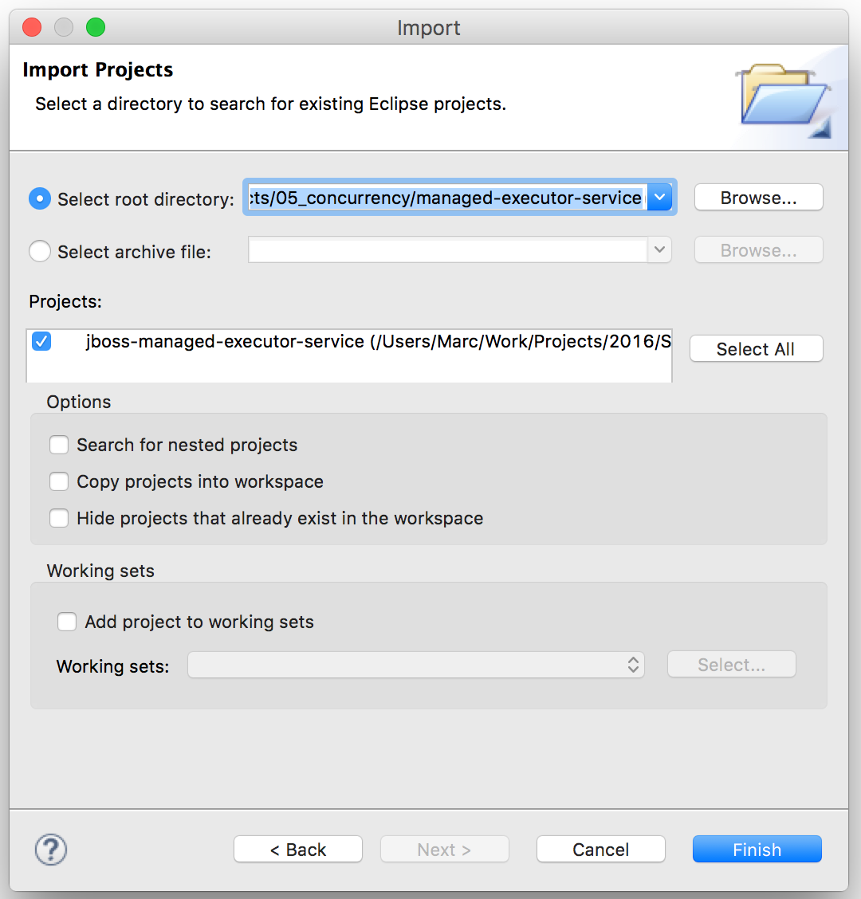
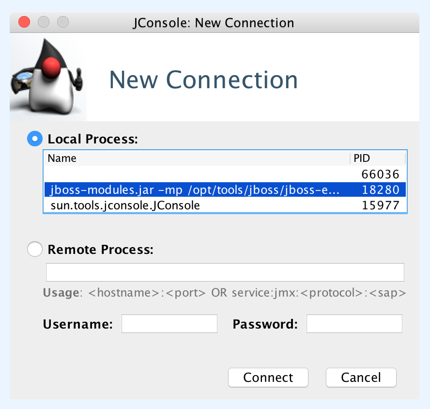
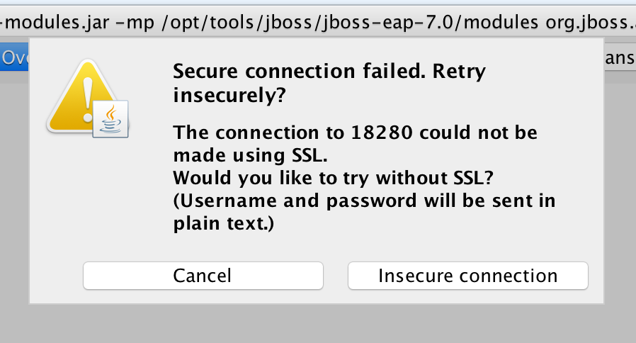
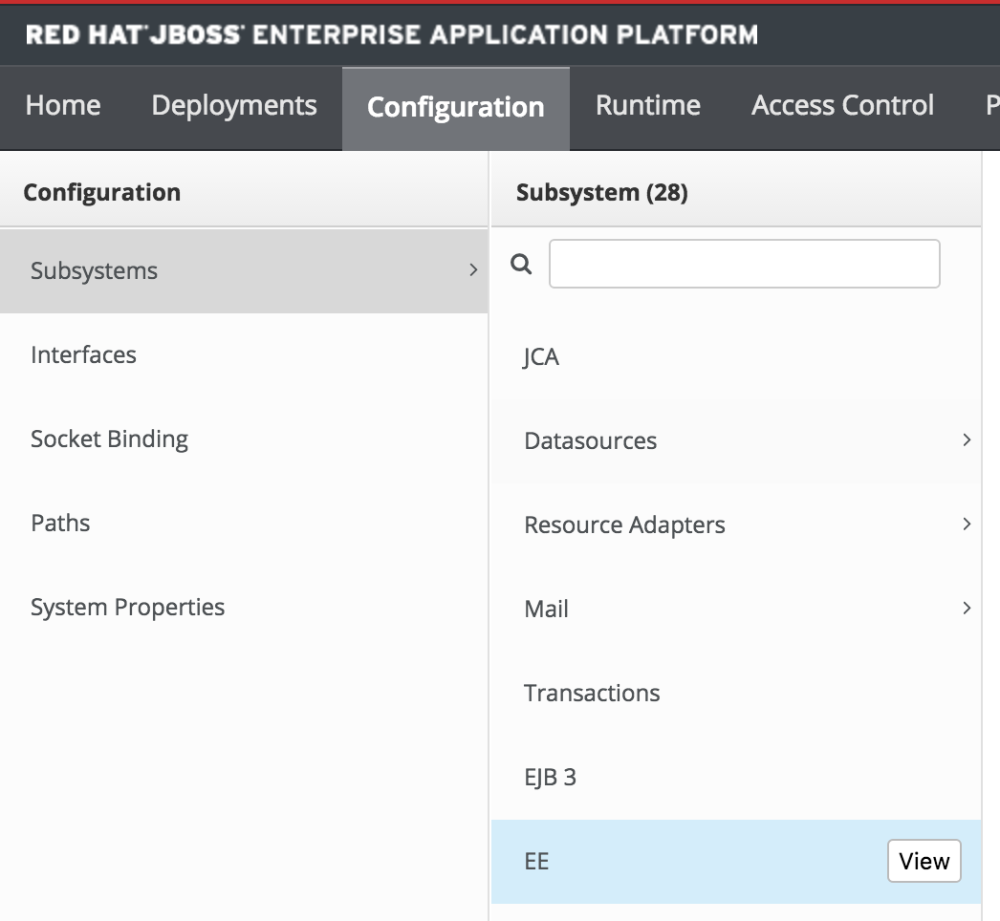
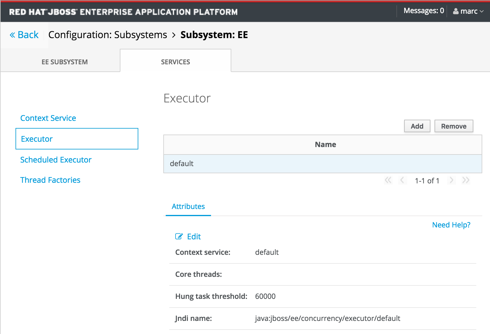

== [Exercise 5] Concurrency Utilities

=== What you will learn

Doing this exercise, participants will learn:

* what are the "Concurrency Utilities for Java EE 1.0"
* how to use the the Java Concurrency API
* how to configure the concurrency services

=== Background information

Concurrency is the ability of a system to execute several tasks in parallel, during overlapping time periods, instead of sequentially. The "Concurrency Utilities for Java EE 1.0" (https://jcp.org/ja/jsr/detail?id=342[JSR342]) specification was developed to fulfill the following goals:

* provide a simple/flexible/usable API for implementing simple and advanced concurrency patterns
* facilitate the migration from Java SE and EE

It has been built on top of the "Concurrency Utilities API" for Java SE (https://jcp.org/ja/jsr/detail?id=166[JSR166]). The specification has been made "Java EE aware" with capabilities like container context propagation, transaction management and task events notification. Thanks to this API, Java EE 7 platforms are aware of the resources used by threads and capable of managing their pools and life-cycles properly.

The API provides thread pools and executor with 4 managed object types in the  `javax.enterprise.concurrent` package:

* *Context* (`javax.enterprise.concurrent.ContextService`)
+
The Context Service is a concurrency utility which creates contextual proxies from existent objects. JBoss EAP 7 Context Services are also used to propagate the context from a Java EE application invocation thread, to the threads internally used by the other EE Concurrency Utilities. Context Service instances may be created using the subsystem XML configuration:
+
[source,xml]
----
<context-services>
  <context-service
  name="default"
  jndi-name="java:jboss/ee/concurrency/context/default"
  use-transaction-setup-provider="true" />
</context-services>
----

* *Thread Factory* (`javax.enterprise.concurrent.ManagedThreadFactory`)
+
The Managed Thread Factory allows Java EE applications to create new threads. WildFly Managed Thread Factory instances may also, optionally, use a Context Service instance to propagate the Java EE application thread’s context to the new threads. Instance creation is done through the EE subsystem, by editing the subsystem XML configuration:
+
[source,xml]
----
<managed-thread-factories>
  <managed-thread-factory
  name="default"
  jndi-name="java:jboss/ee/concurrency/factory/default"
  context-service="default"
  priority="1" />
</managed-thread-factories>
----

* *Executor* (`javax.enterprise.concurrent.ManagedExecutorService`)
+
The Managed Executor Service is the Java EE adaptation of Java SE Executor Service, providing to Java EE applications the functionality of asynchronous task execution. WildFly is responsible to manage the lifecycle of Managed Executor Service instances, which are specified through the EE subsystem XML configuration:
+
[source,xml]
----
<managed-executor-services>
  <managed-executor-service
  name="default"
  jndi-name="java:jboss/ee/concurrency/executor/default"
  context-service="default"
  thread-factory="default"
  hung-task-threshold="60000"
  core-threads="5"
  max-threads="25"
  keepalive-time="5000"
  queue-length="1000000"
  reject-policy="RETRY_ABORT" />
</managed-executor-services>
----

* *Scheduled Executor* (`javax.enterprise.concurrent.ManagedScheduledExecutorService`)
+
The Managed Scheduled Executor Service is the Java EE adaptation of Java SE Scheduled Executor Service, providing to Java EE applications the functionality of scheduling task execution. WildFly is responsible to manage the lifecycle of Managed Scheduled Executor Service instances, which are specified through the EE subsystem XML configuration:
+
[source,xml]
----
<managed-scheduled-executor-services>
  <managed-scheduled-executor-service
  name="default"
  jndi-name="java:jboss/ee/concurrency/scheduler/default"
  context-service="default"
  thread-factory="default"
  hung-task-threshold="60000"
  core-threads="5"
  keepalive-time="5000"
  reject-policy="RETRY_ABORT" />
</managed-scheduled-executor-services>
----

In addition to these main interfaces, the specification provides many other interfaces, for example to monitor the stat of a task's Future object (`ManagedTaskListener`).

=== Lab

This lab builds on the "managed-executor-service" quickstart of JBoss EAP 7. It demonstrates how Java EE applications can submit tasks for asynchronous execution.

The Managed Executor Service (`javax.enterprise.concurrent.ManagedExecutorService`) allows Java EE applications to submit tasks for asynchronous execution. It is an extension of Java SE's Executor Service (java.util.concurrent.ExecutorService) adapted to the Java EE platform requirements.

Step 1 - Build the "managed-executor-service" quickstart project::
+
First build the managed-executor-service project as follows:
+
[source,bash]
----
# Move to the directory of the quickstart
$ cd projects/04_concurrency/managed-executor-service
# Clean and build the quickstart and generate the eclipse project
$ mvn clean eclipse:clean eclipse:eclipse install
# Displays the current path (useful for import in JBDS)
$ pwd
----
+

Step 2 - Import the project in JBoss Developer Studio (JBDS)::
+
Open JBoss Developer Studio (desktop shortcut).
+
Import the maven project you just built. (File -> Import -> Existing Projects into Workspace -> Next -> Paste "root directory") -> Finish)
+
image::images/03_01_import.png["JBDS import (1/2)",600]
+

Step 3 - Have a look at the source code::
+
The imported application contains a JAX-RS resource (`ProductResourceRESTService` class) providing access to several operations that are executed asynchronously:
+
* `PersitTask`
* `LongRunningTask`
* `DeleteTask`
+
Take some time to understand how these classes inter-relate and how the `ManagedExecutorService` is used.
+
A test class (`ProductsRestClientTest`) has been defined to invoke the exposed REST methods and execute the defined tasks. In the next step, we are going to execute this test class.

Step 4 - Start JBoss EAP 7 and deploy the application::
+
Make sure you have started the JBoss EAP 7 server as described previously.
+
You have two options for deploying the "jboss-managed-executor-service.war" binary:
+
* Option 1: maven
+
Type this command to build and deploy the application:
+
[source,bash]
----
$ mvn clean install wildfly:deploy
----
* Option 2: JBDS
+
Right click on "/managed-executor-service/target/jboss-managed-executor-service.war" and select "Mark as Deployable"

Step 5 - Run the tests::
+
This quickstart provides tests that shows how the asynchronous tasks are executed. By default, these tests are configured to be skipped as the tests requires that the application to be deployed first.
+
You have two choices for running the test:
+
* Option 1: use maven
+
[source,bash]
----
$ mvn clean test -Prest-test
----
+
* Option 2: use JBDS
+
To be able to run the tests from JBDS, first set the active Maven profile in project properties to be either 'rest-client'.
+
To run the tests, right click on the project or individual classes and select Run As -> JUnit Test in the context menu.

Step 6 - Investigate the results::
+
Review the console output and relate it to the code. You should see log messages like the following:
+
[source,bash]
----
13:34:07,940 INFO  [ProductResourceRESTService] (default task-51) Will create a new Product on other Thread
13:34:07,940 INFO  [ProductResourceRESTService] (default task-51) Returning response
13:34:07,941 INFO  [PersitTask] (EE-ManagedExecutorService-default-Thread-5) Begin transaction
13:34:07,941 INFO  [PersitTask] (EE-ManagedExecutorService-default-Thread-5) Persisting a new product
13:34:07,946 INFO  [PersitTask] (EE-ManagedExecutorService-default-Thread-5) Commit transaction
13:34:08,002 INFO  [ProductResourceRESTService] (default task-52) Submitting a new long running task to be executed
13:34:08,003 INFO  [ProductResourceRESTService] (default task-52) Waiting for the result to be available...
13:34:08,009 INFO  [LongRunningTask] (EE-ManagedExecutorService-default-Thread-5) Starting a long running task
13:34:08,010 INFO  [LongRunningTask] (EE-ManagedExecutorService-default-Thread-5) Analysing A Product
13:34:08,306 INFO  [ProductResourceRESTService] (default task-52) Waiting for the result to be available...
13:34:08,608 INFO  [ProductResourceRESTService] (default task-52) Waiting for the result to be available...
13:34:08,912 INFO  [ProductResourceRESTService] (default task-52) Waiting for the result to be available...
13:34:09,215 INFO  [ProductResourceRESTService] (default task-52) Waiting for the result to be available...
13:34:09,519 INFO  [ProductResourceRESTService] (default task-52) Waiting for the result to be available...
13:34:09,823 INFO  [ProductResourceRESTService] (default task-52) Waiting for the result to be available...
13:34:10,128 INFO  [ProductResourceRESTService] (default task-52) Waiting for the result to be available...
13:34:10,431 INFO  [ProductResourceRESTService] (default task-52) Waiting for the result to be available...
13:34:10,735 INFO  [ProductResourceRESTService] (default task-52) Waiting for the result to be available...
13:34:11,040 INFO  [ProductResourceRESTService] (default task-52) Result is available. Returning result...56
13:34:11,082 INFO  [ProductResourceRESTService] (default task-53) Will delete all Products on other Thread
13:34:11,082 INFO  [ProductResourceRESTService] (default task-53) Returning response
13:34:11,082 INFO  [DeleteTask] (EE-ManagedExecutorService-default-Thread-5) Begin transaction
13:34:11,083 INFO  [DeleteTask] (EE-ManagedExecutorService-default-Thread-5) Deleting all products
13:34:11,092 INFO  [DeleteTask] (EE-ManagedExecutorService-default-Thread-5) Commit transaction. Products deleted: 1
----

Step 7 - Monitor the thread pools::
+
In order to have a look at how the thread pools are managed, we will use the `jconsole` utility. To do so, open a Terminal and type:
+
[source,bash]
----
$ cd $JBOSS_HOME/bin
$ ./jconsole.sh
----
+
A modal window will open, offering you to select various processes. Select the local process having a name starting with "jboss-modules.jar" and click on "connect".
+

+
A pop-up asking you if an insecure connection should be used is then displayed. Click on "Insecure connection".
+

+
Then you will see the threads used and consumed by the JBoss EAP 7:
+
image::images/05_03_jconsole_threads.png["jconsole threads",500]

Step 8 - Increase the load::
+
Now it is time to increase the load and send a lot of requests showing how the ManagedExecutorService behaves.
+
Find your preferred way to run many times the defined long-running task in parallel. Use then jconsole, as presented in step 7, to have a look on how the thread pool is behaving.
+
For example, you could add a test method like the following one and re-run the test:
+
[source,java]
----
@Test
public void parallelTest() throws InterruptedException {
    Callable<String> c = () -> ClientBuilder.newClient().target(REST_TARGET_URL + "/longrunningtask").request().get(String.class);
    List<Callable<String>> callables = new ArrayList<Callable<String>>();
    for (int i = 0; i < 100; i++) {
      callables.add(c);
    }

    Executors.newWorkStealingPool().invokeAll(callables).stream().map(future -> {
      try {
        return future.get();
      } catch (Exception e) {
        throw new IllegalStateException(e);
      }
    }).forEach(System.out::println);
}
----

Step 9 - Review the EE concurrency configuration::
+
The "Thread" subsystem of JBoss EAP 6 has been removed. Every subsystem needing threads is defining its own thread pool.
+
As described at the beginning of this lab, the Java EE concurrency utilities is configured within the "EE" subsystem of JBoss EAP 7.
+
The configuration can be viewed and modified in the JBoss EAP 7 http://localhost:9990/console/[management console] over Configuration -> Subsystems -> EE, clicking on "View".
+

+
After selecting the "Services" tab, you are able to view and modify the configuration of the four previously listed concurrency services.
+

+
Another option is to use the CLI to retrieve the

=== Summary

In this lab, you learned what are the EE concurrency utilities and how they can be configured within JBoss EAP 7. You deployed and reviewed an application using the Java Concurrency API and monitored the behavior of the application platform using jconsole.

=== Links

For more information, please have a look at the following articles and documents:

* https://docs.jboss.org/author/display/WFLY10/EE+Concurrency+Utilities+Configuration[JBoss EAP 7 - EE Concurrency Utilities Configuration]
* http://www.javabeat.net/managedexecutorservice-concurrency-utilities-java-ee-7-part1[ManagedExecutorService for Implementing Concurrency Utilities in Java EE 7]
* http://www.adam-bien.com/roller/abien/entry/injecting_an_executorservice_with_java[Injecting an ExecutorService with Java EE]
* https://en.kodcu.com/2013/10/java-ee-7-concurrency-utilities-spesification/[Java EE 7 – Concurrency Utilities]
* http://fr.slideshare.net/FredRowe/jsr-236-concurrency-utils-for-ee-presentation-for-java-onesf2013-con7948jsr236[JSR 236 Concurrency Utils for EE (JavaOne 2013)]
