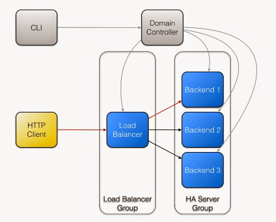
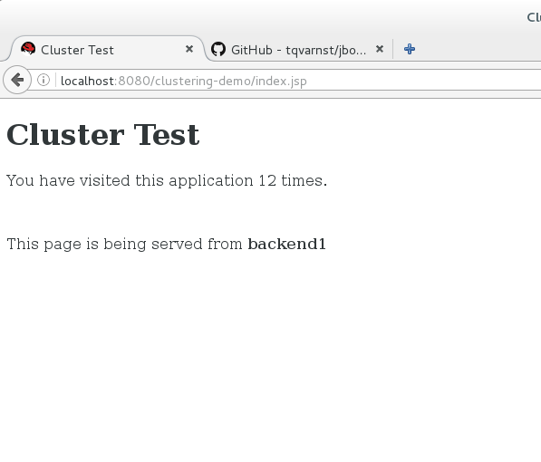
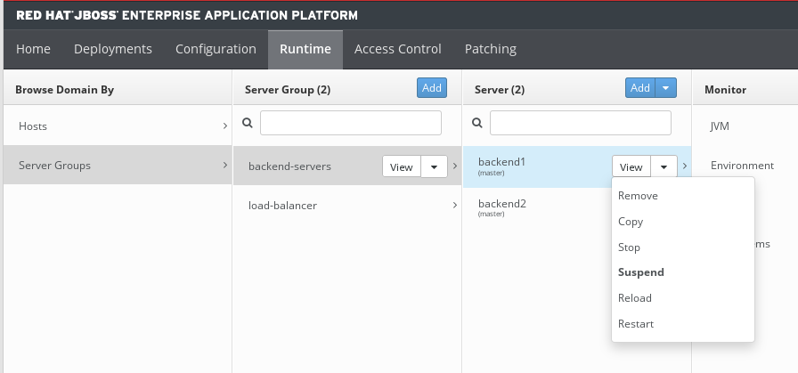
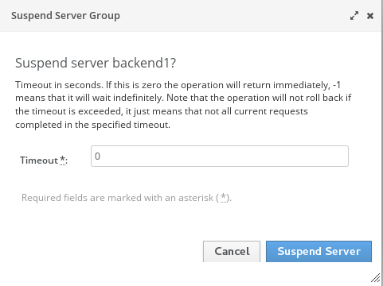

== Exercise 6 - High availability

=== What you will learn

Doing this exercise, participants will learn:

* the basis for setting up a cluster in JBoss EAP 7
* how to use JBoss EAP 7 as a load balancer.

In this exercise participants will also use Ansible to configure and roll-out an high available setup. However this lab will neither cover details about Ansible, nor require previous knowledge of Ansible.

=== Background information

==== Some vocabulary

Before we start, let go through some definitions related to clustering:

* *cluster* : set of server instances using a common communication channel to improve services availability by providing failover, fault-tolerance and scalability capabilities.

* *member or node* : server instance residing on one host and being part of one cluster.

There are three possible and supported clustering topologies:

* *horizontal scaling* : nodes running on different machines
* *vertical scaling* : nodes running on the same machine
* *mixed scaling* : combination of horizontal and vertical topologies

NOTE: Load-balancing and clustering are often mixed-up. Load-balancing is just about dispatching the load between different nodes. Clustering focuses on replicating state between nodes to guarantee failover.

'''

==== Subsystems

The following Red Hat JBoss EAP subsystems are involved in implementing highly available applications:

* *JGroups*
+
JGroups is a toolkit for the underlying communication between nodes.
Two main communication stacks are available in EAP: UDP (default) or TCP (no multicast).
+
JGroup 4 is bundled with EAP 7. It uses a separate dedicated logical interface for clustering ("private"). JGroup 4 uses of NIO.2 and Java 8 features (e.g. CompletableFuture).

* *infinispan*
+
Infinispan is used for data caching and object replication. In Red Hat JBoss  comes with 4 preconfigured caches (cluster, web, SFSB and hibernate).

* *modcluster*
+
mod_cluster is an httpd-based load balancer. Like mod_jk and mod_proxy, mod_cluster uses a communication channel to forward requests from httpd to one of a set of application server nodes.

* *singleton*
+
The singleton subsystem can be used for the deployment of applications as highly-available singletons.

* *Undertow*
+
Undertow is the new web server project integrated in EAP 7. It is a flexible and high performing Java web server providing NIO based blocking and non-blocking APIs.

==== Architecture

The following diagrams shows the lab setup, where JBoss EAP 7 is used as well as an application backend as a load-balancer:

=== Lab

WARNING: Please make sure that your JBoss Developer Studio is closed and all local JBoss are not running when you start this lab. A quick way for doing this is to run the following command:
`killall java`

Step 1 - Reviewing the Ansible setup::
+
We are soon gonna use Ansible to configure the cluster in JBoss EAP 7, but before we kick-off the setup, let's review how the setup looks like.
+
Ansible playbooks describes how different host are assigned different roles. Roles are broken down into different tasks.
+
Because of limitations in the lab environment we are not going to use different different host, but instead we are going to configure a cluster in your local host.
+
Let's first investigate the playbook.
+
[source,yaml]
----
    - hosts: localhost
      roles:
        - jboss-eap-7
----
+
So your localhost will be assigned the role of jboss-eap-7. Let's investigate that as well.
+
[source,yaml]
----
- name: Extract JBoss EAP 7  # <1>
  unarchive: src={{jboss_zip_path}} dest={{ ansible_user_dir }} owner={{jboss_user}} group={{jboss_group}} creates={{jboss_home}} copy=no

- name: Create admin user for JBoss # <2>
  shell: "export JBOSS_HOME={{ jboss_home }}; {{ jboss_home }}/bin/add-user.sh -u admin -p {{ jboss_admin_password }} -s"

- name: Add demo application # <3>
  copy: src={{item}} dest={{ ansible_user_dir }} owner={{ jboss_user }} group={{ jboss_group }} mode=644
  with_items:
    - clustering-demo.war

- name: Add CLI configuration script # <4>
  template: src=mod-cluster.cli dest={{ ansible_user_dir }} owner={{ jboss_user }} group={{ jboss_group }} mode=644

- name: Apply configuration # <5>
  shell: "export JBOSS_HOME={{ jboss_home }}; {{ jboss_home }}/bin/jboss-cli.sh --file={{ ansible_user_dir }}/mod-cluster.cli"

----
<1> In this step the JBoss EAP 7 zip will be extracted, but only if it doesn't previously exists
<2> This task will create an administrative user.
<3> Adding the a WAR application
<4> In this step we will use the template feature of Ansible to add a CLI script
<5> In this step we execute the CLI script.

Step 2 - Review the CLI script::
+
As we can see the Ansible script extracts and adds a administrative user, and then the configuration is a applied via an CLI script.
+
Let's look at the most important actions in the CLI script,
+
[source,bash]
----
embed-host-controller # <1>

/profile=ha:clone(to-profile=backend) # <2>
/profile=default:clone(to-profile=load-balancer) # <3>

/profile=backend/subsystem=modcluster/mod-cluster-config=configuration:write-attribute(name=advertise-security-key, value=mypassword) # <4>

/profile=load-balancer/subsystem=undertow/configuration=filter/mod-cluster=modcluster:add(management-socket-binding=http, advertise-socket-binding=modcluster, security-key=mypassword) # <5>

# Add a server group called backend-servers
/server-group=backend-servers:add(profile=backend, socket-binding-group=ha-sockets) # <6>

# Add server config for backend1 and backend2 using 100 and 200 binding port offset.
/host=master/server-config=backend1:add(group=backend-servers, socket-binding-port-offset=100) # <7>
/host=master/server-config=backend2:add(group=backend-servers, socket-binding-port-offset=200) # <7>

# Add a modcluster filter to the undertow server that will use mulitcast to connect to backend servers
/profile=load-balancer/subsystem=undertow/server=default-server/host=default-host/filter-ref=modcluster:add
/socket-binding-group=standard-sockets/socket-binding=modcluster:add(multicast-port=23364, multicast-address=224.0.1.105) # <8>

# Add the load-balancer server group
/server-group=load-balancer:add(profile=load-balancer, socket-binding-group=standard-sockets # <9>

# Add a load-balancer server to the load-balancer group
/host=master/server-config=load-balancer:add(group=load-balancer) # <10>

# Deploy the application to the servers in the backend-server group
deploy {{ ansible_user_dir }}/clustering-demo.war --server-groups=backend-servers # <11>

----
<1> Starts an embedded host controller so that we can configure the domain without actually starting it. For standalone the same command is `embed-server`. This feature is called Off-line CLI and is new in JBoss EAP 7
<2> This command will clone the `ha` profile and create a new profile called `backend`. The backend servers will be based on `ha` profile since they are going to form a clusters
<3> We also clone the `default` profile to a new profile called `load-balancer` since the load-balancer is not part of the cluster.
<4> Configure the modcluster subsystem in the backend profile to use an advertise security key set to "mypassword"
<5> Adding the mod-cluster filter to the undertow subsystem and configuring the advertise security key to "mypassword"
<6> Create a server group called `backend-servers`
<7> Create servers `backend1` and `backend2` in the `backend-servers` server group.
<8> Add a modcluster filter to the undertow server that will use multicast to connect to backend servers
<9> Add the load-balancer server group
<10> Add a load-balancer server to the load-balancer group
<11> Deploy an application to the backend servers.

Step 3 - Execute the Ansible playbook::
To run the ansible playbook open a terminal window and go to the exercise directory and run the `ansible-playbook` command.
+
[source,bash]
----
$ cd exercises/projects/06_high-availability
$ ansible-playbook playbook.yml
----

Step 4 - Start the JBoss EAP 7 cluster::
To start the cluster is as simple as starting the standalone version, since Ansible helped us configure everything all we need to do is to go to the `$JBOSS_HOME/bin` and execute `domain.sh` instead of `standalone.sh`
+
[source,bash]
----
$ cd ~/jboss-eap-7.0/bin
$ sh domain.sh
----

Step 4 - Verify the application in a browser::
To verify the application open the following url in firefox http://localhost:8080/clustering-demo/index.jsp
+

+
Reload the page a couple of times and notices that the number of request increases, but that the backend-server is always the same. This is because our application is using sessions and mod_cluster is using session affinity (or sticky session).

Step 5 - High availability::

To test the high availability we can suspend the server that our session is connected to. In this step we will use backend-server1, but please you should use the same server that where listed in Step 4.
+
To suspend the server follow the below steps
+
. Open another tab to the admin console (http://localhost:9990)
. Login with username `admin` and password `admin-123`
. Click on `Runtime` tab
. Browse Domain by `Server Groups` -> `backend-servers` -> `backend1`
. Select `Suspend` from the drop down menu next to `backend1`
+

+
. Click on `Suspend Server`
+

. Reload the other firefox tab with the clustering-demo application
+
If everything worked correctly the backend server should now change and the counter should continue from and not restart.

Step 6 - Performance testing::
Now that we have seen how to setup JBoss EAP 7 for clustering and load balancing let's see if we can find the optimal number of servers for this hosts. For this we are going to use a performance tool from Apache HTTPD tools called `ab`.
+
Before we do that we probably want to resume the server that we suspended in step 5. Then we can open a terminal window and run the following command in it.
+
[source,bash]
----
$ curl -s http://localhost:8080/clustering-demo/?[1-10]
----
+
The output should look something like below and include responses from both backend1 and backend2
+
[source,bash]
----
Server backend2
Server backend1
Server backend2
Server backend1
Server backend2
Server backend1
Server backend2
Server backend1
Server backend2
Server backend1
----
+
Then we are ready to start the simple performance test. Execute the following command to put some load onto the server.
+
[source,bash]
----
$ ab -n 10000 -c 100 -k http://localhost:8080/clustering-demo
----
+
This command uses 100 clients to post 100 request with a total of 10 000 request. When the test is done it's going to print a report that looks something like the one below.
+
[source,bash]
----
This is ApacheBench, Version 2.3 <$Revision: 1430300 $>
Copyright 1996 Adam Twiss, Zeus Technology Ltd, http://www.zeustech.net/
Licensed to The Apache Software Foundation, http://www.apache.org/

Benchmarking localhost (be patient)
Completed 1000 requests
Completed 2000 requests
Completed 3000 requests
Completed 4000 requests
Completed 5000 requests
Completed 6000 requests
Completed 7000 requests
Completed 8000 requests
Completed 9000 requests
Completed 10000 requests
Finished 10000 requests

Server Software:        JBoss-EAP/7
Server Hostname:        localhost
Server Port:            8080

Document Path:          /clustering-demo
Document Length:        0 bytes

Concurrency Level:      100
Time taken for tests:   1.627 seconds
Complete requests:      10000
Failed requests:        0
Write errors:           0
Non-2xx responses:      10000
Keep-Alive requests:    10000
Total transferred:      1990000 bytes
HTML transferred:       0 bytes
Requests per second:    6146.27 [#/sec] (mean) # <1>
Time per request:       16.270 [ms] (mean)
Time per request:       0.163 [ms] (mean, across all concurrent requests)
Transfer rate:          1194.44 [Kbytes/sec] received

Connection Times (ms)
              min  mean[+/-sd] median   max
Connect:        0    0   0.2      0       3
Processing:     4   16   8.4     13      63
Waiting:        1   16   8.4     12      63
Total:          4   16   8.5     13      65

Percentage of the requests served within a certain time (ms)
  50%     13
  66%     15
  75%     18
  80%     21
  90%     26
  95%     34 # <2>
  98%     44
  99%     62
 100%     65 (longest request)
----
<1> This is the request per seconds that where processes which is also sometimes refered to as through put.
<2> This table shows how the response times varies and typically a good number to report is how fast 95% the responses where. This means that 95% of your users will get their responses within this time.

=== Summary

In this lab, you learned the differences between clustering and load-balancing, as how to setup those on JBoss EAP 7.

=== Links

For more information, please have a look at the following articles and documents:

* http://infinispan.org/[Infinispan]
* http://mod-cluster.jboss.org/[mod_cluster]
* http://undertow.io/[Undertow]
* http://jgroups.org/[JGroups]
